# 基于出租车大数据的机场出租车运作模型

Table of Contents
=================

   * [基于出租车大数据的机场出租车运作模型](#基于出租车大数据的机场出租车运作模型)
      * [摘要](#摘要)
      * [关键词](#关键词)
      * [一、问题重述](#一问题重述)
      * [二、问题分析](#二问题分析)
         * [2.1 问题一的分析](#21-问题一的分析)
         * [2.2 问题二的分析](#22-问题二的分析)
         * [2.3 问题三的分析](#23-问题三的分析)
         * [2.4 问题四的分析](#24-问题四的分析)
      * [三、模型假设](#三模型假设)
      * [四、符号和概念说明](#四符号和概念说明)
      * [五、问题的建模与求解](#五问题的建模与求解)
         * [5.1问题一的建模与求解](#51问题一的建模与求解)
            * [5.1.1机场排队等待时间模型](#511机场排队等待时间模型)
            * [5.1.2返回市区空驶里程模型](#512返回市区空驶里程模型)
            * [5.1.3载客行车轨迹模型](#513载客行车轨迹模型)
            * [5.1.4基于模型5.1.3的后续运营模型](#514基于模型513的后续运营模型)
            * [5.1.5行驶距离—运营时间模型](#515行驶距离运营时间模型)
            * [5.1.6基于上述分支模型的收益决策模型](#516基于上述分支模型的收益决策模型)
         * [5.2 问题二的建模与求解](#52-问题二的建模与求解)
            * [5.2.1相关数据与模型参数确定](#521相关数据与模型参数确定)
               * [5.2.1.1数据来源介绍](#5211数据来源介绍)
               * [5.2.1.2机场排队载客决策模型确定](#5212机场排队载客决策模型确定)
               * [5.2.1.3直接放空返回市区载客模型确定](#5213直接放空返回市区载客模型确定)
            * [5.2.2 模型求解与决策选择](#522-模型求解与决策选择)
         * [5.3 问题三的建模与求解](#53-问题三的建模与求解)
            * [5.3.1出租车上客区管理模式分析](#531出租车上客区管理模式分析)
            * [5.3.2上客时间模型](#532上客时间模型)
            * [5.3.3“乘车区”出租车时空轨迹模型建立](#533乘车区出租车时空轨迹模型建立)
            * [5.3.4乘车效率分析](#534乘车效率分析)
               * [5.3.4.1连续到达的出租车的通行能力分析](#5341连续到达的出租车的通行能力分析)
               * [5.3.4.2按负指数分布到达的出租车平均逗留时间分析](#5342按负指数分布到达的出租车平均逗留时间分析)
         * [5.4问题四的建模与求解](#54问题四的建模与求解)
            * [5.4.1机场乘客出行距离分布模型](#541机场乘客出行距离分布模型)
            * [5.4.2出租车单位时间净收益模型](#542出租车单位时间净收益模型)
            * [5.4.3模型求解并评价“短途票”机制对于短途出租车的补偿作用](#543模型求解并评价短途票机制对于短途出租车的补偿作用)
      * [六、模型评价与总结](#六模型评价与总结)
         * [6.1 模型的优点](#61-模型的优点)
         * [6.2 模型的缺点](#62-模型的缺点)
         * [6.3 模型的改进](#63-模型的改进)
      * [参考文献](#参考文献)
      * [附录](#附录)
      * [使用软件列表](#使用软件列表)
      * [附录一. 机场排队等待时间仿真(python程序)](#附录一-机场排队等待时间仿真python程序)
      * [附录二. 收益决策模型(MATLAB程序)](#附录二-收益决策模型matlab程序)
      * [附录三. 载客概率-Logistic函数(MATLAB程序)](#附录三-载客概率-logistic函数matlab程序)
      * [附录四. 长途出租车单位时间净收益(MATLAB程序)](#附录四-长途出租车单位时间净收益matlab程序)
      * [附录五. 短途出租车单位时间净收益(MATLAB程序)](#附录五-短途出租车单位时间净收益matlab程序)
      * [附录六. 无优先机制下的长、短途出租车单位时间净收益(MATLAB程序)](#附录六-无优先机制下的长短途出租车单位时间净收益matlab程序)
      * [附录七. 直接返回市区行驶距离-运营时间模型(MATLAB程序)](#附录七-直接返回市区行驶距离-运营时间模型matlab程序)
      * [附录八. 机场排队载客行驶距离-运营时间模型(MATLAB程序)](#附录八-机场排队载客行驶距离-运营时间模型matlab程序)
      * [附录九. 出租车计费图像(MATLAB程序)](#附录九-出租车计费图像matlab程序)
      * [附录十. 乘车区时空轨迹图(MATLAB程序)](#附录十-乘车区时空轨迹图matlab程序)
      * [附录十一. 出租车行驶速度-距机场距离(MATLAB程序)](#附录十一-出租车行驶速度-距机场距离matlab程序)
      * [附录十二. 乘车区出租车通行能力图(MATLAB程序)](#附录十二-乘车区出租车通行能力图matlab程序)
      * [附录十三. “乘车区”出租车平均逗留时长(MATLAB程序)](#附录十三-乘车区出租车平均逗留时长matlab程序)
      * [附录十四. 机场排队载客收益决策模型(MATLAB程序)](#附录十四-机场排队载客收益决策模型matlab程序)
      * [附录十五. 上海市分区地图抓取(HTML   JavaScript程序)](#附录十五-上海市分区地图抓取html--javascript程序)

------

## 摘要

国内多数机场将送客（出发）与接客（到达）通道分开，因此送客至机场的司机将面临前往“乘车区”排队等候载客，还是直接放空返回市区载客的决策问题。该决策取决于司机的个人经验、机场可视性信息及其他不确定信息。此外，对于机场来说，出租车的乘车效率取决于如何安排上客区的运作模式；同时，机场为短途载客出租的“优先权”，将决定不同出租车的收益均衡情况。本文具体量化了出租车决策影响因素、乘车效率影响因素以及收益影响因素，建立具体模型，研究出租车司机的决策方法以及机场合理管理出租车的方法。

针对问题一，本文分别分析了做出不同决策的两车在该时段内的收支情况。建立了机场排队等待时间模型、返回市区空驶里程模型、载客行车轨迹模型、后续运营模型、行驶距离—运营时间模型以及收益决策模型，刻画了出租车在机场载客的运作模式，出租车在城市不同地区的行驶轨迹，城市各地区的交通情况及乘客分布情况，从而帮助司机做出决策。

针对问题二，本文通过搜集到的上海浦东机场航空班次等机场相关信息与利用ArcGIS软件对上海市出租车GPS轨迹数据进行分析的结果信息等，对问题一所建立模型进行信息对接与模型整合。并根据白天和夜间两个时段的具体情况得到针对于浦东机场的出租车收益决策方案，进而判断司机在不同条件下的决策结果，并通过核心参数的变动进行灵敏度分析，判断模型的合理性。

针对问题三，本文选择了适用于双向并行的上客区管理模式，分析“乘车区”出租车的行驶特征考虑了跟驰模式下的延误性，并结合乘客的行为模式确定了出租车的上客时间，建立了时空轨迹模型。根据时空轨迹模型，分别假设出租车连续到达和假设出租车以负指数模式到达的情况，以通行能力和M/M/1排队模型中的平均等待时长作为分析乘车效率的指标，建立模型分析乘车效率最大时的上客区管理模式。

针对问题四，本文选取改进后的“短途票”机制作为“优先”安排方案，以浦东机场为例建立了长途车单位时间净收益模型、普通短途车单位时间净收益模型与“优先”短途车单位时间净收益模型。通过利用完成单位时间净收益模型的求解与绘制的图像，比较推行“短途票”优先机制前后短途车的单位时间净收益是否有增长，即是否达到了尽量均衡出租车收益的目的。

------

## 关键词

ArcGIS软件；时空轨迹模型；M/M/1排队模型；短途票

------

## 一、问题重述

大多数乘客下飞机后要通过出租车的方式前往目的地。国内多数机场都是将送客（出发）与接客（到达）通道分开，乘客需要到指定的“乘车区”排队，在机场管理人员的安排下按先后顺序乘车。送客到机场的出租车司机都将会面临两个选择：留在机场排队等待载客返回市区或直接返回市区。个人经验、机场可视性信息及其他不确定信息均可能影响出租车司机的决策。

试建立数学模型求解下列问题：

(1)综合考虑并分析影响出租车司机决策的相关因素，建立出租车司机选择决策模型，并给出选择策略。

(2)收集相关数据，给出某机场出租车司机的决策，并对模型进行评价。

(3)在“乘车区”有两条并行车道的前提下，为使总的乘车效率最高，该如何设置“上车点”并安排出租车和乘客？

(4)为尽量保持出租车收益均衡，若给予短途载客并返回的出租车“优先权”，试给出一个优先权安排方案。

------

## 二、问题分析

### 2.1 问题一的分析

问题一中，可对机场排队载客与返回市区载客两种选择下后续一定时间内出租车的载客状态进行建模，进而以两种选择于该段时间内所得净收益作为综合评判指标进行决策。

在机场排队载客选择中，综合考虑起始乘客数量，航班班次，蓄车池数量等时间影响因素计算出排队时间，并通过乘客出行里程确定本选择所得净收益；在直接放空返回市区载客选择下，模拟出空驶里程与进入市区后运营模式，进而通过包含空驶的成本及收入计算净收益。

------

### 2.2 问题二的分析

 以上海浦东国际机场为样本对象，收集了民航年度统计信息、机场的具体情况数据，运用问题一中的模型，计算出留在机场排队载客的车辆的排队等待市场。利用ArcGIS软件将收集到的上海出租车GPS标记至地图上，从而分析城市各地区的交通情况和乘客分布情况，并结合出租车的油耗情况及计价模式，计算出在机场载客后离开的出租车的收支情况及载客行驶时间，同时得到直接返回市区的出租车在该时段内的收支情况，进行比较，得到决策结果，并通过灵敏度分析该模型的合理性。

------

### 2.3 问题三的分析

确定适用于两车道的出租车上客管理模式，分析乘客行为模式，计算上客时间。机场内排队前往“乘车区”的出租车以跟驰模式行驶，且每当一批车到达“乘车区”就需要停车上客，即处于排队状态的出租车需间断性的停车，再重新启动向前行驶。根据该行驶模式，建立“乘车区”出租车时空轨迹模型。以出租车平均逗留时间和出租车通行能力，分别作为考虑出租车到达情况与假设出租车持续到达情况下，乘车效率的量化指标。分析在上车点数量不同、位置不同及同批次上客出租车数量不同时的乘车效率，以及模型的合理性。

------

### 2.4 问题四的分析

​    目前国内外机场较普遍的“优先”安排方案是向短途车提供一定条件下返回机场可以免排队接客的“短途票”机制。故本问题中选取改进后的“短途票”机制作为“优先”安排方案，以浦东机场为例建立长途车单位时间净收益模型、普通短途车单位时间净收益模型与“优先”短途车单位时间净收益模型，进而检验“短途票”这种“优先”安排方案是否真正达到了使得出租车的收益尽量均衡的目标。

------

## 三、模型假设

3.1 假设模型研究对象位于一个集散程度较高的单中心城市，且城市道路网为环形放射式，即由穿越市中心区的径向线及环绕市区的环形线共同构成。

3.2 直接放空返回市区载客的出租车后续运营始终在市区及其周边范围内。

3.3 将空驶假设为收益为0的运营任务。

3.4 假设本模型中，所有到达航班完全按照航班时刻表计划运转，即不考虑实时航班信息。

3.5 假设问题一与问题三建立的模型相互独立，即问题一的机场排队等待时间与问题三的通行能力无关。

3.6不考虑上车点距“乘车区”出入口的距离，假设乘客会均匀分配至各个上车点。

3.7所有领取到“短途票”的出租车均会选择重返机场等待下一次载客任务。

------

## 四、符号和概念说明

`r`：出租车与市中心之间的直线距离，单位为公里；

`d`：出租车与机场之间的行驶路程，单位为公里；

`Sd`：出租车与机场之间的直线距离，单位为公里；

`L`：机场到市区边缘的直线距离，单位为公里；

`v`：出租车的行驶速度，单位为公里/小时；

`Se`：出租车直接放空返回市区载客的首段空驶里程，单位为公里；

`Sj`：出租车在机场所接乘客出行里程，单位为公里；

`Sjc`：长途出租车在机场所接乘客出行里程，单位为公里；

`Sjd`：短途出租车在机场所接乘客出行里程，单位为公里；

`Ss`：出租车在市区内所接乘客出行里程，单位为公里；

`Ssf`：出租车在市区内所接乘客出行里程附属空驶里程，单位为公里；

`jmin`：机场距最近的地标性建筑物的距离，单位为公里；

`I`：出租车直接放空返回市区载客后一个结算周期内所完成的运营任务数，单位为个；

`Poi`：出租车直接放空返回市区载客后一个结算周期内开始第次运营任务时距离机场的直线距离，单位为公里;

`δ`：出租车在市区内所接乘客出行的直线距离与里程之比；

`Ss0`：出租车在市区内所接乘客出行的直线距离，`Ss0 = Ss * δ` ，单位为公里；

`Pr`：出租车与市中心之间行驶路程为时遇到乘客的概率；

`Tj`：出租车从决定机场排队载客到完成在机场所接乘客出行任务所花费的总时间，单位为分钟；

`TsI`：出租车从决定直接放空返回市区载客到完成结算周期内次运营任务所花费的总时间，单位为分钟；

`Tj1`：出租车完成在机场所接乘客出行任务所花费的时间，单位为分钟；

`∆T`:  长途车或短途车在机场等待接客时间，单位为分钟。

`α`：选择机场排队载客决策的出租车行车轨迹中射线与直线段之间所夹的转折角，单位为度；

`Sz`:机场单架航班的座位数，单位为个； 

`zmax`：机场单架客机最大座位数，单位为个；

`zmin`：机场单架客机最小座位数，单位为个；

`f`：机场年度统计历史客座率

`P`：单架航班中选择乘坐出租车离开的乘客数，单位为个；

`kd`：白天时段选择出租车离开机场的乘客比例；

`kn`：夜间时段选择出租车离开机场的乘客比例；

`ci`：单辆出租车乘坐人的概率，i={1,2,3,4}；

`A`：机场出发的出租车历史平均载客数，单位为个；

`W`：选择留在机场排队载客的司机的等候总时长，单位为秒；

`Q`：已在“蓄车池”中排队等待的出租车数量，单位为辆；

`U`：在机场排队等候接客的出租车的上客时间，单位分钟；

`D`：“乘车区”内为无乘客状态的总时长，单位为分钟；

`Input`：机场平均每小时进港航班数，单位为架；

`Int`：各相邻到达航班的最大时间间隔，单位为分钟；

`Yh`：出租车每公里油耗，单位为升/公里；

`Yj`：燃油价格，单位为升/元；

`Mj`：出租车在某一结算周期内的净收益，单位为元；

`Mr`：出租车在某一结算周期内的总收入，单位为元；

`Mc`：出租车在某一结算周期内的燃油消耗费用，单位为元；

Zk(S)：出租车里程计价规则，单位为元；

Ml：长途车的单位时间净收益，单位为元/秒；

`Ms`：短途车的单位时间净收益，单位为元/秒；

`K(S)`：出租车距离市中心距离为时的空载率；

`T`：当前时间的时刻点；

`B`：单车道单批次放行出租车数，且数值上等于机场停泊区单车道停泊车位数，单位为辆；

`tw`：自批次开始放行到该批次最后一位乘客排队走入停泊区的时间，单位为秒；

`distance`：相邻乘客在等车队伍中的身位距离，单位为米；

`E`：单车道上车口的数量，单位为个；

`vp`：乘客在等车队伍中行走的速度，单位为米/秒；

`tp`：上客总时间，单位为秒；

`tc`：乘客收拾行李坐入车内的时间，单位为秒；

`tg`：每批次第一组乘客自上车点口走到对应出租车旁花费的时间，单位为秒

`tyi`：与车队首辆车相隔（i-1）个车身位的出租车驾驶员的延迟时间，单位为秒

`tn`：驾驶员正常情况下的感应-反应时间，单位为秒

`tri`：与车队首辆车相隔（i-1）个车身位的出租车驾驶员的松懈时间，单位为秒

`cap`:“乘车区”的通行能力，单位为辆；

------

## 五、问题的建模与求解

### 5.1问题一的建模与求解

#### 5.1.1机场排队等待时间模型

出租车司机在选择留在机场排队载客，还是直接放空返回市区载客时，需要考虑机场排队等待的时间长度。相比直接放空返回市区载客的司机自从机场出发到载上乘客的空驶时长，机场排队等待时间的随机性更小，更多依赖于司机到达机场时“蓄车池”内已有的等待车辆数与此刻“乘车区”内已有的等待人数，以及该时刻后的航班到达情况。

一、确定“乘车区”内的等待人数及其增长情况的计算方法。首先，根据该机场每小时进港航班数的历史平均数据，计算出每架航班之间间隔的时间，即
$$
\operatorname{int} / 60=1 / \text { input }
$$
设定该计算结果模拟生成航班间隔时间区间的上限值，并设其下限值为0，从中等概率随机选取数值，得到每架航班模拟到达的时刻。

其次，统计该机场各客机机型的座位数，从而得知一架航班座位数的期望值。由于经观察经验，中等机型的客机数占比最大，大小型客机数次之，由此本模型采用正态分布模型描述航班的座位数，即
$$
S_{z} \sim \mathrm{N}\left(\mu_{z}, \sigma_{z}\right)
$$
其中μ<sub>z</sub>为该机场航班座位数的期望值，且尽可能保证 zmax <= μ<sub>z</sub> + 3σ<sub>z</sub> 且zmin <= μ<sub>z</sub> - 3σ<sub>z</sub> 。

最后，根据该机场年度统计的客座率，得到每架航班的乘坐人数，再考虑不同时段选择出租车离开机场的乘客比例数据，得到不同时刻前往“乘车区”的乘客数。从实际情况考虑，城市公共交通在其运营期间将分担掉一部分出租车出行的客流量，因此本模型选择将一天分为白天与夜间两个时段。白天时段为城市公共交通运营时段，夜间时段为非运营时段，以自机场出站口步行距离十分钟以内的公共交通中，最早的首班车和最晚的末班车的时刻作为白天时段与夜间时段的划分界限。
$$
P=\left\{\begin{array}{l}{S_{Z} * f * k_{d}},白天时段 \\ {S_{Z} * f * k_{n}}， 夜间时段\end{array}\right.
$$
综合以上步骤，根据该机场的客机机型、航班时刻表及历史统计数据，可得知每一时刻前往“乘车区”选择乘坐出租车离开的乘客数。

二、确定“蓄车池”内已有的等待车辆数与“乘车区”内的等待人数的关系。由于本模型为司机决策模型，所以分析范围仅在司机开始等候到离开机场的时间区域内，即只需考虑司机前方的等待车辆数。前方等待车辆数的递减速度与“乘车区”人数的流失速度具有相关性。因一辆出租车的最大乘坐人数为4人，设定乘坐人数分别为1到4人的出现概率，使其加权后单辆车的载客人数等于该机场出发的出租车历史平均载客数。

$$
c_{1}+2 * c_{2}+3 * c_{3}+4 * c_{4}=A^{4}
$$
利用仿真，可按照上述概率模拟每一辆前方等待车辆载客的人数，由此可以得知前方等待车辆数下降一辆时，“乘车区”流失的人数。需要特别注意的是，需要考虑当“乘车区” 内等待人数下降至0后，前方等待车辆会一直保持不会减少知道下一班次的客流涌入“乘车区”，如下图1与图2。最终，司机的等候总时长为前方等待车辆总上客时间与“乘车区”内无乘客时的总时长之和，即
$$
\mathrm{W}=U * Q+D
$$

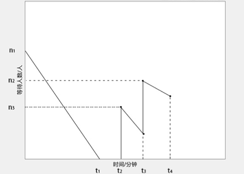

<center>图1 “乘车区”等待人数-时间图</center>
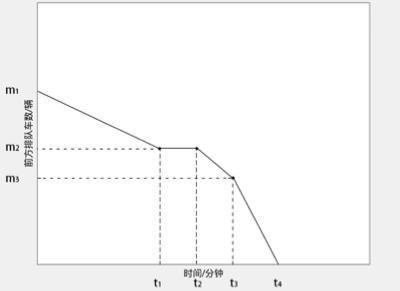

<center>图2“乘车区前方排队车数-时间图”</center>
------

#### 5.1.2返回市区空驶里程模型

对于直接放空返回市区载客的出租车司机，返程途中付出的空载费用是其净收益的主要构成部分之一，而计算空载费用必先确定空驶里程。本模型将空驶里程定义为出租车从机场出发到接到首位乘客所经过路线的长度。


鉴于现实生活中机场一般都建设在距离市区较远的、人烟稀少的郊区，易知在距离机场行驶路程不远的位置遇到乘客的概率相对较小；在出租车逐渐驶入市区的过程中，有乘车需要的市民数量也就越来越多，即代表遇到乘客打车的概率在逐渐变大；而当出租车接近市中心后，等待乘车人数已大于区域出租车服务能力上限，出租车基本处于不间断工作状态，遇到乘客的概率也趋近于峰值。因上述出租车载客概率变化规律近似符合生长曲线函数“发生阶段，变化速度较为缓慢；发展阶段，变化速度加快；成熟阶段，变化速度又趋缓慢”的特点，故改进生长函数曲线中典型的Logistic函数来描述出租车载客概率与其距离机场远近程度之间的关系：
$$
P_{r}=\frac{1}{\frac{1}{k}+a b^{r}}+\mathbf{c}^{4}
$$

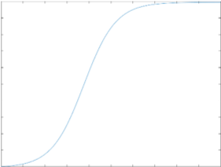

<center>图3. 生长函数图像</center>
同时，用下式代表给定乘车概率值时该位置与机场的距离：
$$
r_{P}=\ln b\left(\frac{k-P_{r}}{a k P_{r}}\right)
$$
在概率论中我们把概率很接近于0（一般取5%-10%）、在大量重复试验中出现的频率非常低的事件称为小概率事件，反之则称为大概率事件。本模型中选取85%作为出租车司机大概率接到乘客的概率值，即观测大量从机场直接放空返回的出租车搭载首位乘客时与机场之间的距离期望值为r<sub>85%</sub>。且为模拟现实生活中的随机性，选取随机系数ω为区间[0.9, 1.1]内的均匀随机数，所求返回市区空驶里程模型：
$$
S_{e}=\omega * r_{85 \%}
$$

------

#### 5.1.3载客行车轨迹模型

无论是出租车在机场排队等候到的乘客、返回市区路中偶遇的乘客或是市区内运营中搭载的乘客，每一次乘客出行里程数都是许多微小的独立随机因素累加影响的结果；由中心极限定理可知“在一般条件下，大量相互独立随机变量的均值经适当标准化后依分布收敛于正态分布”，故令三种情况下乘客出行里程服从参数不同的正态分布。考虑到在机场乘车的乘客出行具有较强的长途性，而靠近市区或市区内所接乘客出行距离则表现出更明显的离散型，令
$$
S_{j} \sim \mathrm{N}\left(\mu_{j}, \sigma_{j}\right) \quad S_{s} \sim \mathrm{N}\left(\mu_{s}, \sigma_{s}\right)
$$
其中，$\mu_{j}>\mu_{S}, \quad \frac{\sigma_{j}}{\mu_{j}}<\frac{\sigma_{S}}{\mu_{S}}$。

同时，在机场乘车的乘客普遍具有市区趋向性，即大多数乘客目的地都在市区，故此时行车轨迹模型可抽象为一段曲线与一条射线所构成的折线：一段表达从机场直通市中心的高速公路几何形状的曲线；另一条是以高速公路与市区边缘交点为起点的一簇放射线中的一支。而靠近市区或市区内所接乘客出行方向可近似看作偏向市区的随机出行，即市区内行车终点是以上车点为圆心、S<sub>s0</sub>为半径的圆周上、在统计层面上具有偏向市区特点的某一点。

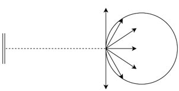

<center>图4.机场乘车乘客出行轨迹抽象图</center>
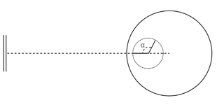

<center>图5.市区或市区内乘客出行轨迹抽象图</center>
------

#### 5.1.4基于模型5.1.3的后续运营模型

由模型假设知，直接放空返回市区载客的出租车司机在返回市区途中接到首位乘客后，便维持一个在市区及市区周边载客运营的状态；且为表示形式统一，本模型及后续模型中均将空驶作为一种特殊的、没有载客收入、仅存在燃油消耗费用的载客运营任务。

考虑到即使在市区及市区周边这样一个出租车载客概率较高的区域，仍然会有最低百分之十以上的空驶率，所以即使在市区内出租车也一定是载客与空驶状态相互切换的模式。为使建模形式清晰简洁且最贴近现实情况，令空驶为每次运营任务的附属里程，其中空驶的里程数由运营里程与所处位置出租车的空驶率共同决定：
$$
S_{s f}=S_{s} * \mathrm{K}(S)
$$
将运营里程与附属的空驶里程绑定在一起便得到了直接放空返回市区载客的出租车司机后续运营的模型。即该运营模型可以表述为：以出租车从机场出来后个接客点为圆心，以5.3中行车轨迹模型指向该运营任务的终点，同时该终点作为附属空驶的起点，继续应用行车轨迹模型指向空驶的终点，同时该终点即是下一段运营任务的起点；如此循环往复即可得到直接放空返回市区载客的出租车的后续运营示意图。

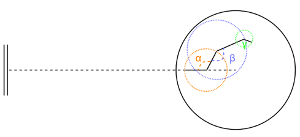

<center>图6. 后续运营轨迹抽象图</center>
------

#### 5.1.5行驶距离—运营时间模型

行驶距离—运营时间模型即为表达出租车完成某一结算周期内所有运营任务所行驶的距离与行驶该距离所花费时间之间关系的函数。NathanH. 通过对英国6个城市的研究发现,车辆行驶的平均速度与距离CBD的距离有关,以市中心的放射线道路为研究对象,将道路按照一定的距离分割成若干段然后进行观测,并以观测数据建立模型[1]。经检验以模型描述城市内部行车速度效果较好，故选取该模型作为本文中出租车行驶速度的函数表达式：
$$
\mathrm{v}=\mathrm{a}-\mathrm{b} e^{c d}
$$
其中, a,b,c均为系数。

利用微积分知识可知，出租车由距离机场的位置d1移动至位置d2所花费时间为$\int_{d_{1}}^{d_{2}} \frac{d S d}{v}$。故对于做出机场排队载客决策的出租车，其行车轨迹模型的组合性导致其距离时间模型为曲线与直线两部分时间累加的分段函数：
$$
T_{j 1}=\left\{\begin{array}{ll}{\int_{0}^{S_{j}} \frac{d S \mathrm{d}}{v}} & {S_{j} \leq L} \\ {\int_{0}^{\mathrm{L}} \frac{d \mathrm{Sd}}{v}+\int_{\mathrm{L}}^{\mathrm{Sd}} \frac{d \mathrm{Sd}}{v}} & {S_{j}>L}\end{array}\right.
$$
其中可由余弦定理给出：
$$
\mathrm{Sd}=\sqrt{L^{2}+\left(S_{j}-L\right)^{2}-2 L\left(S_{j}-L\right) \cos \alpha^{4}}
$$
而对于做出直接放空返回市区载客决策的出租车，其完成所有运营任务所花费时间为：
$$
T_{s I}=\int_{0}^{S_{e}} \frac{d S \mathrm{d}}{v}+\sum_{i=2}^{I} \int_{P o_{i}}^{P o_{i+1}} \frac{d S \mathrm{d}}{v}
$$

------

#### 5.1.6基于上述分支模型的收益决策模型

对于进行决策的出租车而言，决策所带来的净收益是影响决策的最重要的因素；又考虑到选择机场排队载客的出租车在结束机场所接乘客运营任务后，在市区及周边运营模型与选择直接放空返回市区载客的出租车相同，可以近似认为两种选择的出租车产生的净收益期望相同。综上，选取以某出租车决定在机场排队载客为计时起点、以该出租车在结束机场所接乘客运营任务为计时终点所确定的时间段为一个结算周期；则该结算周期内两种选择所带来的净收益即为收益决策模型的决定指标。

定义出租车在某一结算周期内的净收益等于出租车在某一结算周期内的总收入与出租车在某一结算周期内的燃油消耗费用之差，即
$$
M_{j}=M_{r}-M_{c}
$$
定义出租车单次载客收入与单次行驶距离S之间的计价关系为Z<sub>k</sub>(S)、出租车行驶过程中每百公里油耗为Y<sub>h</sub>、燃油单价为Y<sub>j</sub>。则选择机场排队载客的出租车的结算周期时长为
$$
T_{j}=W-T_{j1}
$$
结算周期内的净收益为
$$
M_{j1}=Z_{k}(S_j) - S_j*Y_h*Y_j
$$

对于直接放空返回市区载客的出租车而言，由于最后一班运营任务（空载）的结束时间很难保证与结算周期的计时终点重合，所以为防止其运营任务被结算周期强行割裂，可将直接放空返回市区载客的出租车的结算周期延时至周期内最后一班运营任务结束，即T<sub>sI</sub>满足不等式
$$
T_{sl} >= T_j > T_{s(l-1)}
$$

此时，该出租车结算周期内的净收益为
$$
M_{j 2}=\sum_{i=1}^{I} Z_{k}\left(S_{s i}\right)-\sum_{i=1}^{I}\left(1+\mathrm{K}\left(S_{s i}\right)\right) S_{s i} * \mathrm{Y}_{\mathrm{h}} * Y_{j}
$$
故本收益决策模型可表达为
$$
P=\left\{\begin{array}{l}{选择机场排队载客},M_{j1} > M_{j2}\\ {选择直接放空返回市区载客}，M_{j2} > M_{j1}\end{array}\right.
$$

------

### 5.2 问题二的建模与求解

#### 5.2.1相关数据与模型参数确定

##### 5.2.1.1数据来源介绍

​    本问题以上海市浦东机场为例；以接近10万条数据的2007年的上海GPS出租车数据集[2]作为上海市出租车相关数据，其特征包括：出租车ID、时间、经度、维度、夹角角度、出租车的瞬时速度和出租车载客状态等；以的上海城市地图导出数据作为上海道路网构建数据基础。

------

##### 5.2.1.2机场排队载客决策模型确定

机场排队载客收益决策模型中，综合运用了机场排队等待时间模型、载客行车轨迹模型、行驶距离-运营时间模型和决策收益模型。相关数据可分为机场运营情况、城市交通数据和出租车收支模式三方面。[3,4]

<center>表1.上海浦东国际机场运营情况</center>


<center>表2.上海城市交通数据</center>


<center>表3.上海出租车收支模式</center>


首先，计算机场排队等待时间。根据上表中的数据，可知每架航班的时间间隔`int = 1.82`，即在[0,1.82]中随机产生数据作为相邻航班的间隔时`zmax = 550`, `zmin = 124`, μ<sub>z</sub>=295，所以设定σ<sub>z</sub>，即$S_{z} \sim \mathrm{N}(295,60)$

同时，结合数据可知
$$
P=\left\{\begin{array}{l}{S_{Z} * 0.832 * 0.45}, 白天时段 \\ {S_{Z} * 0.832 * 0.15}， 夜间时段\end{array}\right.
$$
即
$$
\left\{\begin{array}{c}{P \sim N(110,23)}，白天时段 \\ {P \sim N(37,7)}，夜间时段\end{array}\right.
$$
为使`c1 + 2*c2 + 3*c3 + 4*c4`的值趋近与A，在1-100中等概率产生随机数，当该数属于[1,60]时设定上车人数为1，属于[61,92]时设定上车人数为2，属于[93,98]时设定上车人数为3，属于[99,100]时设定上车人数为4，进行仿真得到等候时长。设定前面已等候在“蓄车池”内的车数范围为(0,50)，仿真结果如下。

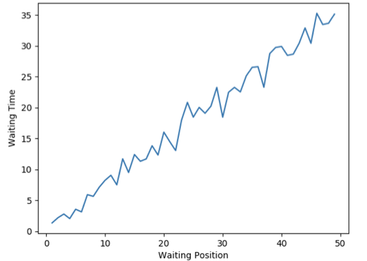

<center>图7.机场排队等待时间仿真</center>
根据正态分布的“3σ”原则并结合表中机场乘客平均出行距离与机场距最近的地标性建筑物的距离，模拟出5.1.3载客行车轨迹模型中S<sub>j</sub>所服从的最或然正态分布为`N(34,12)`；为确定出租车行驶速度的函数表达式：$v=a-b e^{c d}$的各项参数，将表格中城市高速路限速作为机场位置上出租车行驶速度、上海市中心平均车速作为市中心位置上出租车行驶速度，由边界条件解出参数值，即得到具体的速度函数表达式为：$\mathrm{v}=24.27+4.77 e^{0.1 d}$；

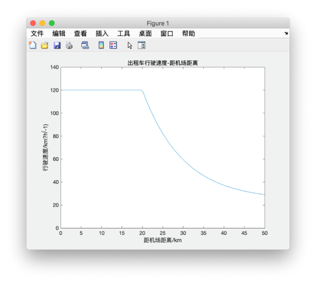

<center>图8. 出租车行驶速度-距机场距离图</center>
则行驶距离—运营时间模型可依行驶速度函数具化为
$$
T_{j 1}=\left\{\begin{array}{ll}{\int_{0}^{s_{j}} \frac{d S \mathrm{d}}{v}} & {s_{j} \leq L} \\ {\int_{0}^{30} \frac{d S \mathrm{d}}{v}+\int_{30}^{S \mathrm{d}} \frac{d S \mathrm{d}}{v}} & {S_{j}>L}\end{array}\right.
$$
其中可由余弦定理给出：
$$
\mathrm{Sd}=\sqrt{30^{2}+\left(S_{j}-30\right)^{2}-2 * 30 *\left(S_{j}-30\right) \cos \alpha}
$$
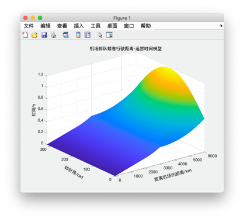

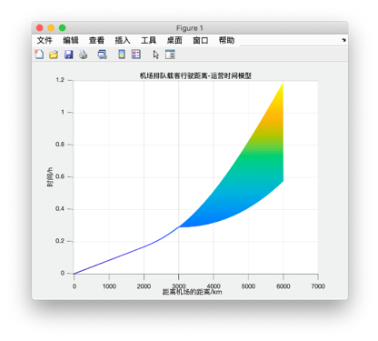

<center>图9.机场排队载客行驶距离-运营时间模型</center>
由浦东国际机场出租车相关规定可查得出租车计价标准为“白天（5:00-23:00）起步价14元/3公里，3-15公里单价2.5元/公里，15公里以上3.6元/公里；夜间（23:00-次日5:00）起步价18元/3公里，3-15公里单价3.1元/公里，15公里以上单价4.7元/公里”，即Z<sub>k</sub>(S)可由分段函数表示为[5]：
$$
Z_{k}(S)=\left\{\begin{array}{lr}{14} & {\mathrm{S} \leq 3 \mathrm{H} 且\mathrm{T} \in[5 : 00-23 : 00]} \\ {14+2.5(S-3)} & {3<\mathrm{S} \leq 15 \mathrm{H} 且\mathrm{T} \in[5 : 00-23 : 00]} \\ {44+3.6(S-15)} & {15<\mathrm{S} \mathrm{H} 且  \mathrm{T} \in[5 : 00-23 : 00]} \\ {18} & {\mathrm{S} \leq 3 \mathrm{H} 且\mathrm{T} \in[23 : 00-5 : 00]} \\ {18+3.1(S-3)} & {3<\mathrm{S} \leq 15 \mathrm{H}且 \mathrm{T} \in[23 : 00-5 : 00]} \\ {55.2+4.7(S-15)} & {15<\mathrm{S} \mathrm{H}且 \mathrm{T} \in[23 : 00-5 : 00]}\end{array}\right.
$$
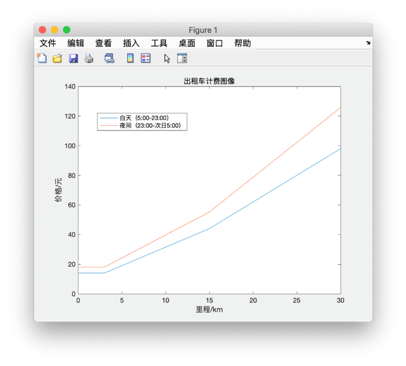

<center>图10.出租车计费图像</center>
综上可得选择机场排队载客的出租车的结算周期内的净收益
$$
M_{j 1}=Z_{k}\left(S_{j}\right)-S_{j} * Y_{h} * Y_{j}=Z_{k}\left(S_{j}\right)-0.049 S_{j}
$$

------

##### 5.2.1.3直接放空返回市区载客模型确定

对于直接放空返回市区载客模型而言，为得到最终的收益决策模型，不仅需要“5.2.1.2机场排队载客决策模型确定”中部分现有模型或数据，除此之外还需要确定返回市区空驶里程模型、乘客出行里程数服从的正态分布、汽车空驶率模型与行驶距离—运营时间模型。

根据正态分布的“3σ”原则并结合市中心乘客打车平均出行距离6.9km与出租车计价表中起步价所对应的3km，模拟出5.1.3载客行车轨迹模型中S<sub>s</sub>所服从的最或然正态分布为N(6.9,1.3)；确定返回市区空驶里程模型即为确定核心函数——生长曲线函数的三个参数数值。应用“发生阶段，变化速度较为缓慢；发展阶段，变化速度加快；成熟阶段，变化速度又趋缓慢”的特点与黄金分割的思想，选取0,0）、（50*0.618，P<sub>r</sub>max/2）、（50，P<sub>r</sub>max）三点作为函数特征点；同时考虑到早、晚高峰同平峰时人流量差距会对出租车载客概率产生影响，故在早高峰、晚高峰、平峰阶段分别对P<sub>r</sub>max赋值为0.95、0.92、0.89，如此可得载客概率——Logistic函数为
$$
P_{r}=\left\{\begin{array}{ll}{\frac{1}{1+175.90 * 0.760^{x}}-0.06} & {\mathrm{T} \in[7 : 00-9 : 00]} \\ {\frac{1}{1+91.079 * 0.789 x}-0.011} & {\mathrm{T} \in[17 : 30-19 : 30]} \\ {\frac{1}{1+59.149 * 0.809 x}-0.017} & {\mathrm{T} \in[19 : 30-7 : 00] \cap[9 : 00-17 : 30]}\end{array}\right.
$$
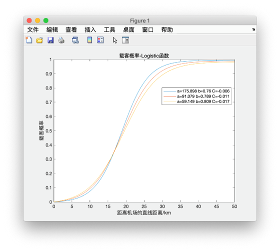

<center>图11.载客概率-Logistic函数图</center>
借助载客概率——Logistic函数，可将直接放空返回市区载客的行驶距离—运营时间模型确定为
$$
T_{s I}=\int_{0}^{\ln b\left(\frac{k-0.85}{0.85 a k}\right)} \frac{d \mathrm{Sd}}{v}+\sum_{i=2}^{I} \int_{P o_{i}}^{P o_{i+1}} \frac{d \mathrm{Sd}}{v}
$$
其中a、b、k同载客概率——Logistic函数中不同条件下的参数值

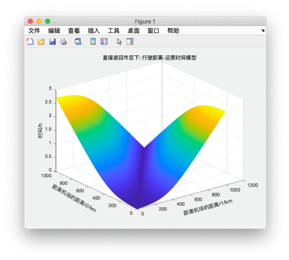

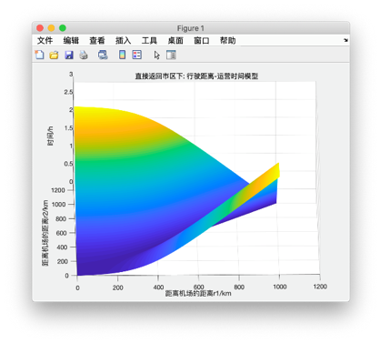

<center>图12.直接返回市区下：行驶距离-运营时间模型图</center>
为得到空载率与距市中心距离之间的函数关系，本模型依托地理信息软件ArcGIS，利用2007年的上海GPS出租车数据集与OpenStreetMap提供的上海道路网，对浦东机场到上海市中心部分区域进行道路网与GPS出租车数据集进行交集制表，可得浦东机场到上海市中心部分区域空载率——道路分布表。由表内数据得到该部分区域内各街道出租车平均空载率后，将其展点至对应道路，便可得到浦东机场到上海市中心部分区域空载率——道路分布图，并以高亮表示空载率较低的各个小区域。
对浦东机场——上海市中心连线沿线道路空载率进行数学拟合后，发现空载率与距浦东机场距离近似接近于反比例关系，则根据具体道路与机场距离sd∈[5,50]及空载率取值范围K<sub>sd</sub>∈[14%,100%]推算得K<sub>sd</sub>=4.78/sd+0.044

<center>表4.上海市部分道路空驶率统计表</center>
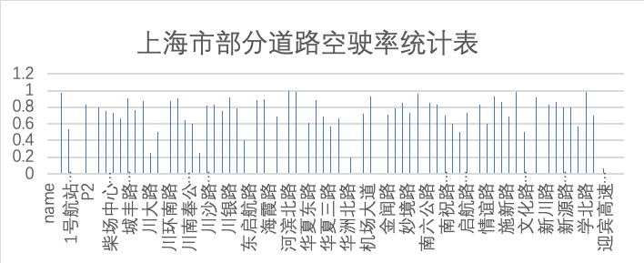

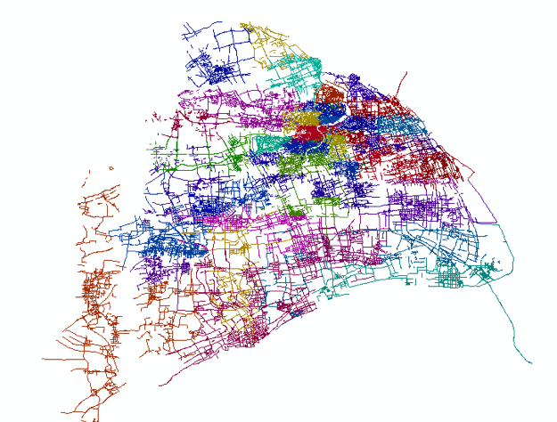

<center>图13.上海市道路网</center>
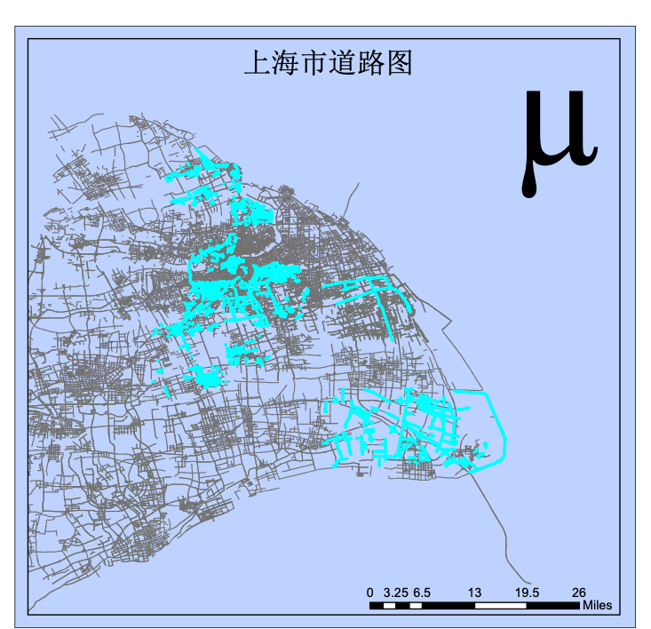

<center>图14.上海市部分道路空载率分布图</center>
------

#### 5.2.2 模型求解与决策选择

以5.2.1.2机场排队载客决策模型中净收益M<sub>j1</sub>作为Z轴、运营时间T<sub>j1</sub>作为X轴、运营里程S<sub>j</sub>为Y轴，利用matlab软件生成净收益决策模型三维示意图如图15 。由于给定某个运营里程S<sub>j</sub>，运营时间便存在一个不为零的极小值，故该示意图为一个X轴附近残缺的曲面。读图知当S<sub>j</sub>较小时，M<sub>j1</sub>增长很缓慢；随着S<sub>j</sub>的不断增大，M<sub>j1</sub>进入一个快速增长的区间，最后斜率较小，极值趋于稳定。

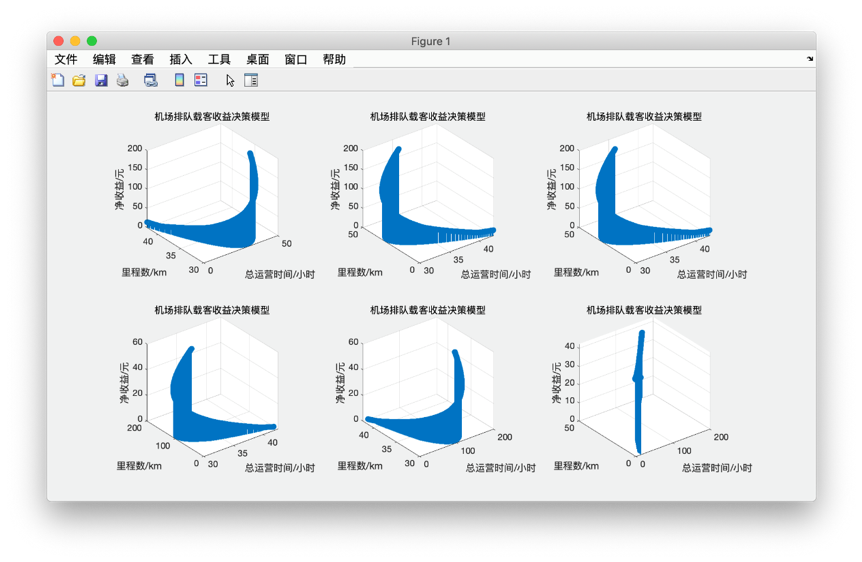

<center>图15.机场排队载客收益决策模型</center>
图16为两种净收益决策模型三维交汇示意图。从函数表达上看运营时间T<sub>j1</sub>与运营里程S<sub>j</sub>相关性极大，故两曲面于YZ面投影于近乎为两条相交的曲线，也说明两种决策下的净收益模型相比于运营时间更加依赖于运营总里程数。
读图知，当运营里程较小时直接放空返回市区载客模型的净收益决策模型更优，即选择机场排队载客决策的出租车花费很长时间后接到一个运营里程数较小的乘客情况下，直接放空返回市区载客模型更值得出租车司机去选择；有关机场排队载客决策的出租车花费很长时间后接到一个运营里程数较小的乘客的补偿问题，将会在第四问中专门讨论。而当运营里程较长时，机场排队载客决策就表现出了绝对的优势。而机场大部分旅客目的地都在较远的市区内，出行里程也很可观，所以综上可知，大部分出租车司机送乘客到机场后会选择净收益期望值更高的鞥机场排队载客决策；而这也与现实生活中情况很接近，故模型具有较高的合理性。

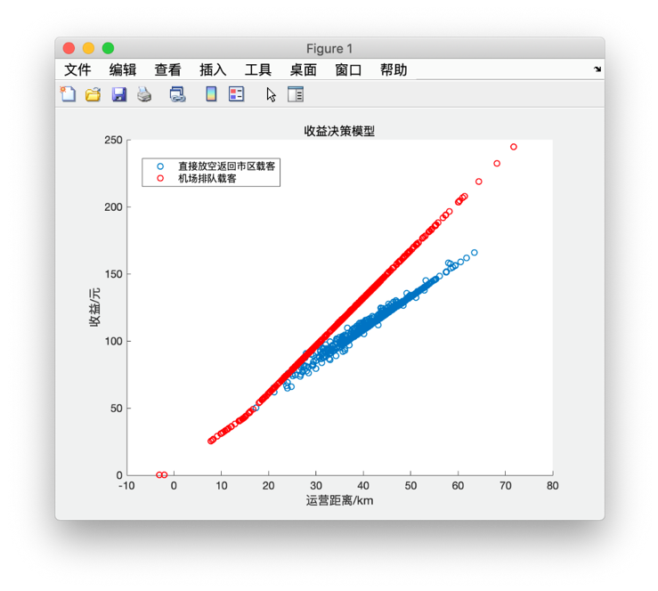

<center>图16. 收益决策模型</center>
------

### 5.3 问题三的建模与求解

#### 5.3.1出租车上客区管理模式分析

如题可知，机场“乘车区”有两条并行车道，则可以适用的上客区管理模式有如下几种：
模式一：一条车道用于作为停泊区，另一条车道作为通过道路，乘客从停泊区远离通过道路的一侧上车，如图17。

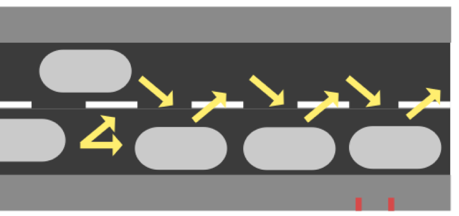

<center>图17.上客区管理模式一示意图</center>
出租车进入“乘车区”后，停入停泊区，接客后可变道至通过道路离开。每当停泊区出现空位，即由后车补上。该模式由于各出租车独立进出停泊位，容易造成互相影响，除了上客时间，还将面临为避让其他出租车出入停车位增加的避让时间，造成乘车效率低下。同时，考虑到安全问题，不采取该模式。
模式二：两条车道都划分一段作为停泊区，车辆按批次进入停泊区，所有乘客自道路的同一侧上车，即乘客可以任意选择两条车道上处于停泊区的出租车，如图18；

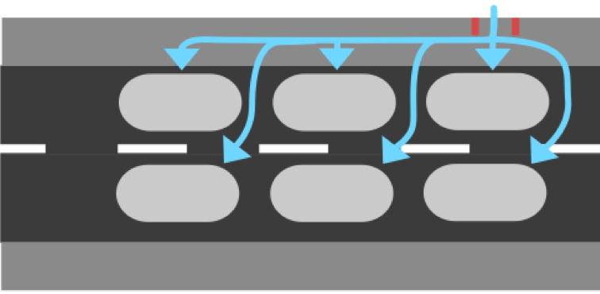

<center>图18. 上客区管理模式二示意图</center>
模式三：两条车道都划分一段作为停泊区，车辆按批次进入停泊区，但乘客分两批从道路两侧上车，即乘客仅可选择距离自己更近的道路的停泊区内的出租车，两条道路各自运转，如图19。

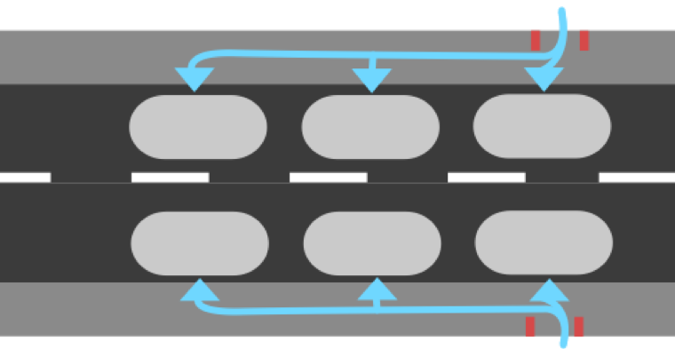

<center>图19. 上客区管理模式三示意图</center>
模式二与模式三采用相同的停泊区划分方法，唯一差别是两条道路是否独立工作。为保证乘客，当有乘客步入停泊区时，所有停泊区内的出租车皆不可启动行驶。在该规定下，考虑到乘客行走至较远车道时花费的时间更长，即模式二下双车道所有出租车的共同等候时间会比模式一下等候时间长。由此，本文选择模式三作为出租车上客区管理模式。

------

#### 5.3.2上客时间模型

上客时间具体指自该批次最后一辆出租车停入对应停车位乘客进入停泊区至该批次最后一位乘客坐上出租车的时间。当确定了一批次车数后，根据单辆出租车的历史平均载客数可以合理推断该批次乘坐出租的乘客人数。
$$
P=AB
$$
其中，在后文计算中参考上海浦东国际机场，设定A=1.5。
为尽可能减少各上车点之间的差异，将各个上车点平均设置在停泊区上。且规定乘客走出上车点后，仅能乘坐该上车点到下行相邻上车点之内的车辆。不考虑上车点距“乘车区”出入口的距离，假设乘客会均匀分配至各个上车点。为尽量缩短上客时间，规定每个上车点进入停泊区的第一组乘客，乘坐离上车点最远的出租车（如图20），则其花费时间如下式：
$$
t_{g}=(B-1) * \operatorname{length} /\left(\mathrm{E} v_{p}\right)
$$
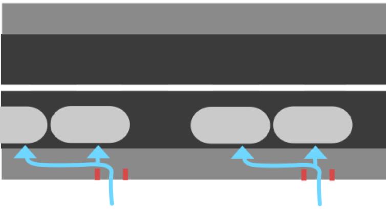

<center>图20.规定乘坐模式示意图</center>
其中，参考上海浦东国际机场的数据length=6。在不同出行目的下，行人的步行速度不同，如下表5[6]。当乘车队伍开始放行，乘客的行走模式更偏向于具有交通出行目的的两点间位置的移动，考虑到在携带行李向前行走的速度相比自由行走速度会有所减低，所以设定v<sub>p</sub>=1.3。

<center>表5.三类典型步行目的及步行特征</center>
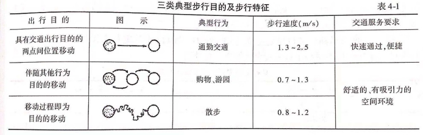

同时，上车点数量越多，该批次乘客排队走入停泊区的总时间就越短。最后一位排队走入停泊区的乘客所花费的时间如下式：
$$
t_{w}=(P * \text { distance }) /\left(\mathrm{E} v_{p}\right)
$$
由于在队伍中，乘客与乘客间的距离较近，且行走受限，可以近似假设乘客的活动空间为静态空间。[6]在机场等候出租车的乘客大多携带行李，即空间需求大约在0.40~0.55（m^2/人)，又因为人体椭圆面积如右图21[6]，在此设定distance=0.8。

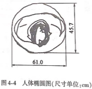

<center>图21. 人体椭圆尺寸在单位（cm）</center>
<center>表6.静态空间要求</center>
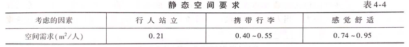

通过比较以上两式可知，当$B>1.25$时$t_w<t_g$，考虑到现实情况，单批次的车辆数通常在2辆以上，所以在计算时，上客总时间设定为各上车点第一组乘客走到对应出租车停车位所花费的时间与其收拾行李坐入车内的时间之和。
$$
t_P=t_g+t_c
$$
其中，依据经验设定$t_c=30$。

------

#### 5.3.3“乘车区”出租车时空轨迹模型建立

由于采用模式三，两车道各自运转，在此针对单车道分析“乘车区”出租车时空轨迹模型。首先，车队中每批次的出租车都需要停入停泊区上客，每辆出租车一定存在一段时间时空位置保持不变。其次，排队进入停泊区的出租车的行驶状态取决于前车的行驶状态，每晚一个批次，停车次数就会增加一次；且由于跟驰模式的延误性，前后车切换行驶状态的时间点会存在时间差，且该时间差与车队长度有关。再者，由于停泊区位置固定，每批次的首位车都会在停泊区第一个停车位的时空位置停留一段时间，同理每批次的第二位、第三位等会停留在对应停车位，且各相邻出租车停留的时空位置差即为停泊位的大小。而车辆的停留时间包括等待同批次车队所有车停入停泊区的时间和上客时间。最后，该批次车在停泊区停留后，驶离“乘车区”，后一批次按跟驰模式随之驶入停泊区。出租车辆的启动加速度与制动加速度不纳入考虑，近似匀速行驶，即时空轨迹图中各斜线段的斜率为车辆在“乘车区”行驶的平均速度，在此参考上海浦东国际机场的数据设定$v ̅=8$。
虽然车队长度对延误时间差产生影响，但一方面因为车队中距离停泊区较远的出租车的延迟时间对停泊区段的运转影响较小，另一方面因为需要等待所有车辆停下后，才会允许乘客上车，即在每次允许乘客上车前会修正延误时间造成的影响，所以在此仅需分析两次修正之间产生的延误时间，即下一批次进入停泊区的出租车产生的延误时间。由驾驶员特性研究可知，当外界因素刺激时，驾驶员会经历感知、识别、决策、反应四个阶段，可用感知-反应时间量化。在本模型中假设所有驾驶员正常状态下的感知-反应时间相同为3秒，但当车队过长时，驾驶员往往会产生松懈情绪，造成感知-反应时间增加。在此将超过正常状态下的感知-反应时间的时长称作松懈时长，与驾驶员距该批次车队首位车的距离有关。正常状态下的感知-反应时间与松懈时长共同组成了延误时长。
$$
\begin{array}{c}{t_{r i}=x / 5} \\ {t_{y i}=t_{n}+t_{r i}}\end{array}
$$
由此，可以得到出租车的时空轨迹图（示意图如下图22）。

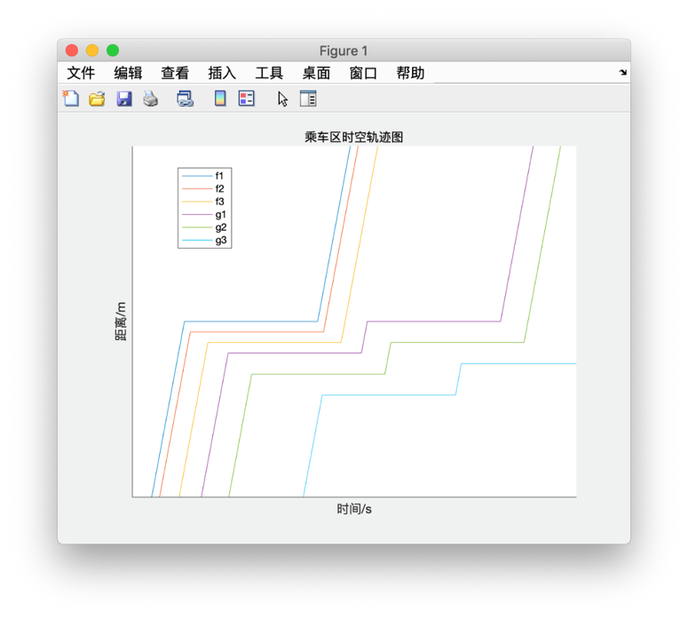

<center>图22.“乘车区”时空轨迹图</center>
在该例中，展示了两个批次放行车辆的的时空轨迹图，其中单批次车辆数B=3，上车点个数E=2。函数$f_1,f_2,f_3$为第一批次出租车的时空轨迹图，函数$g_1,g_2,g_3$为第二批次出租车的时空轨迹图。时空轨迹图通用的函数公式及相关计算如下（a为常数对图形位置有影响对整体形状无影响，相同字母为一批次，下标i表示该车是该批次的第i辆）：
$$
f_{1}(x)=\left\{\begin{array}{cl}{\overline{v} x+a,} & {x \leq 0} \\ {a,} & {0<x \leq k} \\ {\overline{v}(x-k)+a, x} & {>k}\end{array}\right.
$$
其中，$\mathrm{k}=(B-1) * t_{n}+\sum_{i=1}^{B} t_{y i}+t p^{4}$
$$
\begin{array}{l}{f_{2}(x)=f_{1}\left(x-t_{y 2}\right)-\text { length }} \\ {f_{3}(x)=f_{2}\left(x-t_{y 3}\right)-\text { length }}\end{array}
$$

$$
g_{1}(x)=\left\{\begin{array}{cl}{f_{B}\left(x-t_{y 1}\right)-\text {length,}} & {x \leq h+\frac{\text {length}}{\overline{v}} * B} \\ {a,} & {h+\frac{\text {length}}{\overline{v}} * B<x \leq h+\frac{\text {length}}{\overline{v}} * B+k^{\prime}} \\ {\overline{v}(x-k-h)+a, x>} & {h+\frac{\text {length}}{\overline{v}} * B+k}\end{array}\right.
$$

其中$\mathrm{h}=t_{n} * \mathrm{B}+\sum_{i=1}^{B} t_{y i}$
$$
g_{2}(x)=g_{1}\left(x-t_{y 2}\right)-\text { length }
$$

------

#### 5.3.4乘车效率分析

##### 5.3.4.1连续到达的出租车的通行能力分析

出租车连续到达，即保证每批次的出租车数量始终固定，不存在全体乘客都需要等待的情况。此时，通行能力可由两相邻批次最后一辆车停入停泊位的时间差内离开的出租车数决定。由于为相互独立运作的双向并行车道，在计算通行能力时，可将单车道的通行能力翻倍，得到“乘车区”的总通行能力。

$$
\operatorname{cap}=2 * \mathrm{B} * 3600 /\left(t_{P}+\sum_{i=1}^{2 B-1} t_{y i}+\frac{\text { length }}{\overline{v}} * B\right)
$$
其中

$$
\begin{array}{c}{t_{P}=t_{g}+t_{c}} \\ {t_{g}=(B-1) * \frac{l e n g t h}{\mathrm{E} v_{p}}} \\ {t_{c}=30} \\ {t_{r i}=x / 5} \\ {t_{y i}=t_{n}+t_{r i}^{4}}\end{array}
$$
可得：

$$
\operatorname{cap}=2 * \mathrm{B} * 3600 /\left((B-1) * \frac{\text {length}}{\mathrm{E} v_{p}}+30+\sum_{i=1}^{2 B-1}(x / 5+3)+\frac{\text { length }}{\overline{v}} * B\right)
$$
带入设定数值，得到

$$
\operatorname{cap}=2 * \mathrm{B} * 3600 /\left((B-1) * \frac{6}{\mathrm{E} * 8}+30+\frac{6}{8} * B+\sum_{i=1}^{2 B-1}(x / 5+3)\right)
$$
由上式可知，通行能力仅与单车道单批次车辆数B与单车道上车口的个数E有关，得到下图23。

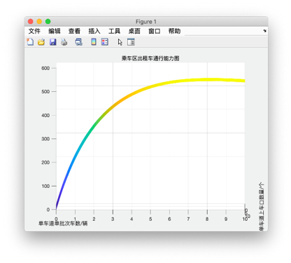

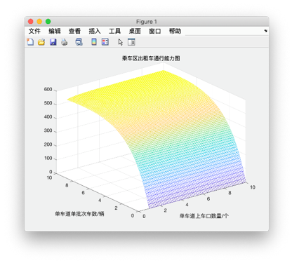

<center>图23. 乘车区出租车通行能力图</center>
由于在现实情况中，单车道的上车口数量大于单车道单批次出租车数量是无意义的，且上车口数量与出租车数量皆为正整数的离散点。从而得到下表7，可知当B=8，E=8时通行能力最大。此外还可发现，随单批次出租车数量的变化，通行能力变化较大；通行能力随上车口数量增加而单调增加，但增加幅度较小。

<center>表7. 乘车区出租车通行能力离散点列表</center>
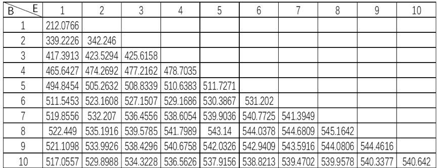

------

##### 5.3.4.2按负指数分布到达的出租车平均逗留时间分析

通常认为每小时每车道的不间断车流量等于或小于500辆时，用负指数分布描述车头时距是符合实际的。[6]假设出租车到达符合负指数分布，把上客过程看作是服务过程，将出租车视作顾客，即可应用M/M/1排队模型进行求解。M/M/1排队模型公式如下：
系统的服务强度为：$ρ=λ/μ$，其中λ为平均到达率，μ为平均服务率；
顾客的平均逗留时间为：$W_s=1/(μ-λ)$。
根据连续型交通流分布中的负指数分布公式可知：$λ=Q/3600$，其中Q为小时交通量。根据《交通工程》教材[6]中提供的观测数据及对该模型的描述，在此设定Q=300，则λ=0.083。
由定义可知：1/μ 为每个服务的平均时长，即可由两相邻批次最后一辆车停入停泊位的时间差除以离开的出租车数得到，数值上$μ=cap/2$，则
$$
W_S=1/(cap/2-λ）
$$
可知，出租车平均逗留时间也仅与单车道单批次车辆数B与单车道上车口的个数E有关,作图如下图24。

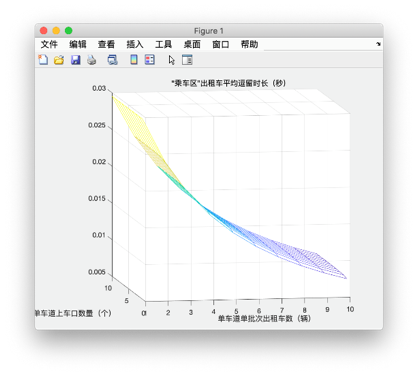

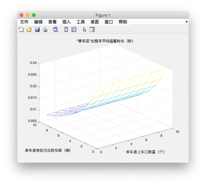

<center>图24.“乘车区”出租车平均等待时长</center>
如上图可知，若利用M/M/1排队模型，假设出租车按负指数分布到达，单车道单批次出租车数越多，出租车平均逗留时长久就越短，该模型过于理想化，不适用于实际情况。

------

### 5.4问题四的建模与求解

#### 5.4.1机场乘客出行距离分布模型

根据浦东机场 “持有短途票、出租汽车行驶里程在22公里以内且在一小时内返回的，方可进入缓冲区”的短途车进入标准可知，运营里程在22公里以下的称为短途载客。
由5.1.3载客行车轨迹模型知，机场乘客出行距离服从正态分布，即
$$
S_j~N（34,12）
$$
而某辆出租车在机场接到的一次乘客出行是否属于短途载客则服从0-1分布，即
$$
\mathrm{P}\{X=k\}=p_{22}^{k}\left(1-p_{22}\right)^{1-k}
$$
其中k=0,1，$p_22$为k=1、即此次运营任务为短途载客的概率。
$$
p_{22}=\int_{0}^{22} \frac{1}{12 \sqrt{2 \pi}} \exp \left(-\frac{(x-34)^{2}}{288}\right)=0.1585
$$
上式符合“浦东机场每天出租车流量在七千辆左右，其中有15%到20%承接了短途生意”的现状，也从侧面证明了5.1.3载客行车轨迹模型的正确性。

------

#### 5.4.2出租车单位时间净收益模型

定义单位时间净收益为净收入与等待、运营时间之和的比值；由于“短途票”机制是为了补偿短途载客出租车在机场蓄车池过长时间等候的机会成本，所以与单纯的使用载客收入或者净收益相比，以单位时间净收益作为参考指标更能体现出对短途载客出租车机会成本的补偿程度。

首先考虑较简单的长途车单位时间净收益模型。由5.1.6基于上述分支模型的收益决策模型与5.1.5行驶距离—运营时间模型可分别得到长途车的净收益与运营时间，则长途车单位时间净收益

$$
M_{l}=\frac{M_{j 1}}{T_{j 1}+\Delta T}
$$
而短途车情况相对复杂一些：由于假设拿到短途票的出租车完成运营任务后均会回到机场再次载客，所以在第n+1次接到长途运营任务之前，该出租车会持续“短途运营任务—返回机场—短途运营任务”的循环工作状态n次。考虑到$p_{22}^6=0.0001586$,已接近于十万分之一，故设定出租车连续接到短途运营任务的上限为6次。
取$S_jd $代表短期运营任务，$S_jc$ 代表长期运营任务；
则$S_{jd}~N（34,12$）且$S_{jd}≤22$；$S_{jc}~N（34,12$）且$S_{jc}≥22$。
则短途车单位时间净收益
$$
M_{d}=\frac{M_{j n}}{\Delta T+\sum_{i=1}^{n} \int_{0}^{S_{j d i}} \frac{d S \mathrm{d}}{v}+T_{j 1}}
$$
其中
$$
M_{j n}=\sum_{i=1}^{n} p_{22}^{n-1}\left[Z_{k}\left(S_{j d i}\right)-2 S_{j d i} * Y_{\mathrm{h}} * Y_{j}\right]+p_{22}^{n-1}\left(1-p_{22}\right)\left[Z_{k}\left(S_{j c}\right)-2 S_{j c} * Y_{\mathrm{h}} * Y_{j}\right]
$$
令
$$
a_{1}=E\left(Z_{k}\left(S_{j d n}\right)-2 S_{j d n} * Y_{h} * Y_{j}\right)=Z_{k}\left(E\left(S_{j d n}\right)\right)-2 E\left(S_{j d n}\right) * Y_{\mathrm{h}} * Y_{j}
$$
则
$$
M_{j n} \sim \frac{1}{1-p_{22}} a_{1}+p_{22}^{n-1}\left(1-p_{22}\right)\left[Z_{k}\left(S_{j c}\right)-2 S_{j c} * Y_{\mathrm{h}} * Y_{j}\right]^{4}
$$

------

#### 5.4.3模型求解并评价“短途票”机制对于短途出租车的补偿作用

本问题利用matlab完成单位时间净收益模型的求解与图像绘制与比较。
图一绘制了由正态分布$N（μ_j,σ_j ）$生成的全部大于22公里的$(S_j1 、S_j2 、···、S_j10 )$所决定的十条长途车的单位时间净收益——总时间函数图。图二由一组图组成，每张图分别对应$n=1、2、3、4、5、6$的不同前提条件下，由正态分布N（μ_j,σ_j ）生成全部小于22公里的$(S_j1 、S_j2 、···、S_j10 )$所决定的十条短途车的单位时间净收益——总时间函数图；并将图一插入到图二全部六张图中、以便比较。

读图1可得，随着总运营时间（等待时间）不断变长，长途车载客收入均摊化愈发严重，故曲线产生了很快速的的函数值下降，并最终稳定在20/h左右。读图二可得，在没有“短途票”优先机制的情况下，无论长或者短，长途车的单位时间净收益均高于短途车。即短途出租车确实会面临净收益全面低于长途出租车的窘况，对某些短途载客再次返回的出租车给予一定的“优先权”很有必要。读图三可得，“短途票”优先机制的情况下，随着n即短途出租车连续返回次数不断增加，短途出租车与长途出租车的差距不断减小；当n=3时长、短途出租车单位时间净收益基本持平，甚至当n>3时短途出租车已经在某些时间段下超过了长途出租车。综上所述，“短途票”优先机制确实可以达到使得蓄车池中等待出租车的收益尽量均衡的目的。

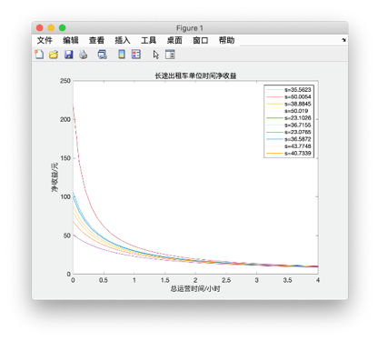

<center>图25. 长途出租车单位时间净收益</center>
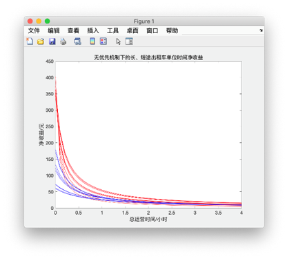

<center>图26.无优先机制下的长、短途出租车单位时间净收益</center>
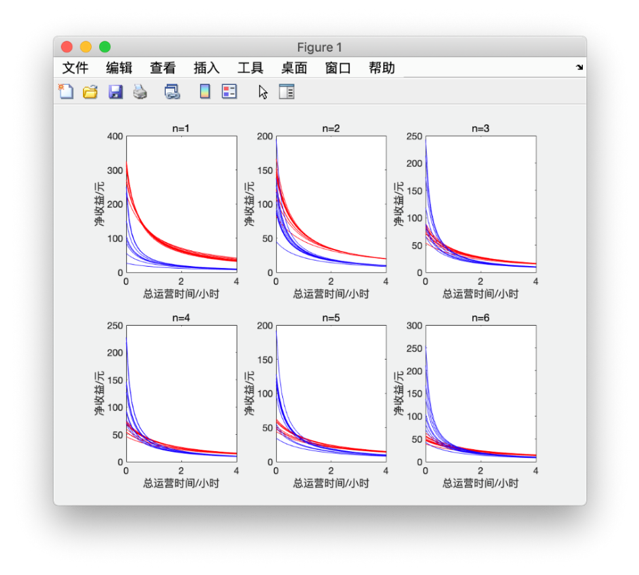

<center>图27.优先机制下的长、短途出租车单位时间净收益对比图</center>
------

## 六、模型评价与总结

### 6.1 模型的优点

问题一将影响出租车司机的各个指标影响因素都考虑在内，通过建立或抽象或具体的数学模型综合考虑这些指标对出租车后续运营模式的影响。在问题二确定空载率模型时，通过出租车GPS大数据与专业地理信息软件ArcGIS对上海市部分区域道路进行空载率统计，有力的保证了所建立模型的正确性。问题三中先后使用了时空轨迹图与排队论两种不同的理论进行建模与求解，提高了模型的容错性。问题四中通过对短途车比例的验算测试了问题一中正态分布模型的合理性，有效地建立了车流量与运营里程两者间的联系。

------

### 6.2 模型的缺点

在问题一建立载客行车轨迹模型的过程中抽象化、理想化过高，在建模简洁的同时也大大简化了本是高度非线性的汽车运营规律，很难真正模拟出大量出租车的出行轨迹；问题三中排队论的建模过程中应用了部分并不很符合实际情况的理论模型，导致建模结果不如预期中理想。

------

### 6.3 模型的改进

可以将问题二中应用ArcGIS出租车GPS数据集所得结果在浦东机场区域进一步进行数据挖掘与数据分析，便可以为问题三、问题四中提供一定的仿真依据。
7.4 模型的推广
问题三中应用了交通方向专业课程中部分经典理论，使得模型具有一定的普适性，对于分析机场及其周边交通流、出租车运营模式及发展机场公交有一定指导意义。

------

## 参考文献

[1]刘俊娟,王炜,肖美丹.单中心城市内部车流密度和行车速度模型研究[J].铁道科学与工程学报,2011,8(01):113-117. 

[2]佚名. 上海GPS出租车数据集[DB/OL]. https://download.csdn.net/download/feng512275/10978231, 2019-9-13.

[3]中国民用航空局．2018年民航行业发展统计公报

[EB/OL].http://www.caac.gov.cn/XXGK/XXGK/TJSJ/201905/t20190508_196033.html, 2019-5．

[4]李音.浦东机场增运能 起降航班加至每小70架次[EB/OL].http://news.carnoc.com/list/287/287527.html,2014-07-11

[5]佚名.浦东国际机场交通[EB/OL].https://flights.ctrip.com/booking/airport-pudong/jichangjiaotong.html,2019-09-15

[6]吴娇蓉．交通工程[M]．北京：人民交通出版社，2018-10．

------

## 附录

  * [使用软件列表](#使用软件列表)
  * [附录一. 机场排队等待时间仿真(python程序)](#附录一-机场排队等待时间仿真python程序)
  * [附录二. 收益决策模型(MATLAB程序)](#附录二-收益决策模型matlab程序)
  * [附录三. 载客概率-Logistic函数(MATLAB程序)](#附录三-载客概率-logistic函数matlab程序)
  * [附录四. 长途出租车单位时间净收益(MATLAB程序)](#附录四-长途出租车单位时间净收益matlab程序)
  * [附录五. 短途出租车单位时间净收益(MATLAB程序)](#附录五-短途出租车单位时间净收益matlab程序)
  * [附录六. 无优先机制下的长、短途出租车单位时间净收益(MATLAB程序)](#附录六-无优先机制下的长短途出租车单位时间净收益matlab程序)
  * [附录七. 直接返回市区行驶距离-运营时间模型(MATLAB程序)](#附录七-直接返回市区行驶距离-运营时间模型matlab程序)
  * [附录八. 机场排队载客行驶距离-运营时间模型(MATLAB程序)](#附录八-机场排队载客行驶距离-运营时间模型matlab程序)
  * [附录九. 出租车计费图像(MATLAB程序)](#附录九-出租车计费图像matlab程序)
  * [附录十. 乘车区时空轨迹图(MATLAB程序)](#附录十-乘车区时空轨迹图matlab程序)
  * [附录十一. 出租车行驶速度-距机场距离(MATLAB程序)](#附录十一-出租车行驶速度-距机场距离matlab程序)
  * [附录十二. 乘车区出租车通行能力图(MATLAB程序)](#附录十二-乘车区出租车通行能力图matlab程序)
  * [附录十二. “乘车区”出租车平均逗留时长(MATLAB程序)](#附录十二-乘车区出租车平均逗留时长matlab程序)
  * [附录十三. 机场排队载客收益决策模型(MATLAB程序)](#附录十三-机场排队载客收益决策模型matlab程序)
  * [附录十四. 上海市分区地图抓去(HTML   JavaScript程序)](#附录十四-上海市分区地图抓去html--javascript程序)

## 使用软件列表

- MATLAB_R2019a
- Pycharm
- WebStrom

------

## 附录一. 机场排队等待时间仿真(python程序)

```python
import matplotlib.pyplot as plt
import matplotlib
matplotlib.use('TkAgg')
import random
from threading import Thread,Timer
from time import sleep,time
import numpy as np
import sys


customers = []
waitTime = 0.5
STATE = 'DAY'       # 'NIGHT

def getCustomerNum():
    tmp = random.randint(1, 100)
    if tmp>=1 and tmp<=60:
        return 1
    elif tmp>=61 and tmp<=92:
        return 2
    elif tmp>=93 and tmp<=98:
        return 3
    elif tmp==99 or tmp==100:
        return 4

def growCustomer():
    time_per_planeNum = 60/33
    stepTime = random.uniform(0, time_per_planeNum)
    sleep(stepTime/10)

    # customer_mu = 36.833 if STATE=='DAY' else 110.488
    # customer_sigma = 7.488 if STATE=='DAY' else 22.464
    customer_mu = 36.688/6
    customer_sigma = 7.488/6

    customerNum = int(np.random.normal(customer_mu, customer_sigma, 1)[0])

    for _ in range(customerNum):
        customers.append(1)

    global timer
    timer = Timer(0.01, growCustomer)
    timer.start()

def getWaitTime(pos):

    global customers
    customers.clear()
    print(pos)

    total_waitTime = 0

    while pos>0:
        # print(pos)
        sleep(waitTime/100)
        total_waitTime += waitTime

        if customers:
            tmp = getCustomerNum()
            customerNum = min(tmp, len(customers))
            customers = customers[customerNum:]

            pos -= 1
        else:
            start = time()
            while not customers:
                pass
            end = time()

            tmp = getCustomerNum()
            customerNum = min(tmp, len(customers))
            customers = customers[customerNum:]

            pos -= 1
            total_waitTime += end-start

    return total_waitTime


def main():
    N = 100      # 蓄车池最大容量
    pos_x = [i for i in range(1, N)]
    waitTime_y = list(map(getWaitTime, pos_x))

    plt.figure()
    plt.plot(pos_x, waitTime_y)
    plt.xlabel('Waiting Position')
    plt.ylabel('Waiting Time')
    plt.show()

    global timer
    timer.cancel()


'''启动全局定时器'''
timer = Timer(0, growCustomer).start()


if __name__=='__main__':
    main()
```

------

## 附录二. 收益决策模型(MATLAB程序)

```matlab
clear
clc

S = zeros(1,500);
V = zeros(1,500);

for j=1:500
    for k=1:6
        si = normrnd(6.9,3,1);
        S(1,j) = S(1,j) + si;
        V(1,j) = V(1,j) + fee(si) - MultiSpend(si);
    end
end

figure;
scatter(S,V);
hold on;

title('收益决策模型');
xlabel('运营距离/km');
ylabel('收益/元');
legend('直接放空返回市区载客','机场排队载客');

for j=1:500
    waitPlot();
end


function spend =  MultiSpend(s)
spend = 0.2*log(s) + 4.78;
end


function waitPlot()

S = normrnd(34,12,1);

V_day = fee(S) - WaitSpend(S);

scatter(S,V_day,'r');
legend('直接放空返回市区载客','机场排队载客');

end


function spend = WaitSpend(s)
spend = 0.049*s;
end


function val = fee(s)
% 出租车计费

fee1 = 14;
fee2 = 14 + 2.5*(s-3);
fee3 = 14 + 2.5*12 + 3.6*(s-15);

val = (fee1).*(s>=0 & s<=3) + (fee2).*(s>3 & s<=15) + (fee3).*(s>15);
end
```

------

## 附录三. 载客概率-Logistic函数(MATLAB程序)

```matlab
clear
clc

figure;

AA = zeros(1,3);
BB = zeros(1,3);
CC = zeros(1,3);

for k=1:3
    syms x y a b C

    s1 = 30;
%     P = 0.95;
    if k==1
        P=0.95;
    elseif k==2
        P=0.92;    
    else
        P=0.89;
    end
    K = 1;

    x1 = s1;
    y1 = P;
    eq1 = y1 == K/(1 + a * b^x1) - 1/(1 + a);
    % eq1 = y1 == K / (1 + b * exp(1)^(-a*x1))-1/(b+1)

    x2 = s1*0.618;
    y2 = P*0.5;
    eq2 = y2 == K/(1 + a * b^x2) - 1/(1 + a);
    % eq2 = y2 == K / (1 + b * exp(1)^(-a*x2))-1/(b+1)


    [a,b] = solve(eq1, eq2, a, b);
    C =  - 1/(1 + a);
    
    AA(1,k) = round(a*1000)/1000;
    BB(1,k) = round(b*1000)/1000;
    CC(1,k) = round(C*1000)/1000;
    
    for ii=1:size(a)
        try
            y = 1/(1 + a(ii) * b(ii)^x) + C(ii);
            ezplot(y, [0, 50, 0, 1]);
            hold on;
        end
    end
    
end

title('载客概率-Logistic函数');
xlabel('距离机场的直线距离/km');
ylabel('载客概率');
legend(['a=',num2str(AA(1,1)),' b=',num2str(BB(1,1)),' C=',num2str(CC(1,1))],['a=',num2str(AA(1,2)),' b=',num2str(BB(1,2)),' C=',num2str(CC(1,2))],['a=',num2str(AA(1,3)),' b=',num2str(BB(1,3)),' C=',num2str(CC(1,3))]);
```

------

## 附录四. 长途出租车单位时间净收益(MATLAB程序)

```matlab

clear
clc

syms r

a = 24.2741; b = -4.7659; c = -0.1000;
V = a - b * exp(-c * (50 - r));

S = zeros(1,10);

for k=0:9
    s = normrnd(34,12,1);
    S(1,k+1) = s;
    v = (14).*(s>=0 & s<=3) + (14 + 2.5*(s-3)).*(s>3 & s<=15) + (14 + 2.5*12).*(s>15);
    top = v - 0.049 * s;
    
    if s<20
        bottom = int(1/120,r,0,r);
    else
        bottom = int(1/120,r,0,20) + int(1/V,r,20,s);
    end
    
    t=0:0.1:4;
    y = top./(t+bottom);
    if k==0, figure; end
    try
        plot(t,y);
    end
    if k==0, hold on; end
    
end

title('长途出租车单位时间净收益');
xlabel('总运营时间/小时');
ylabel('净收益/元');
legend(['s=',num2str(S(1,1))],['s=',num2str(S(1,2))],['s=',num2str(S(1,3))],['s=',num2str(S(1,4))],['s=',num2str(S(1,5))],['s=',num2str(S(1,6))],['s=',num2str(S(1,7))],['s=',num2str(S(1,8))],['s=',num2str(S(1,9))],['s=',num2str(S(1,10))])
```

------

## 附录五. 短途出租车单位时间净收益(MATLAB程序)

```matlab
clear
clc

figure;

for k=1:6
    subplot(2,3,k);
    plot1block(k)
    title(['n=',num2str(k)]);
    xlabel('总运营时间/小时');
    ylabel('净收益/元');
end


function plot1block(n)

p22 = 0.1585;
a1 = fee(22) - 2 * 22 * 0.049;

%% 生成n个Sjdi
Sjdi = zeros(1,n);
for k=1:n
    while(1)    % assert(Sjdi<=22);
        Sjdi(1,k) = normrnd(34,12,1);
        if Sjdi(1,k)<=22, break; end
    end
end

for z=1:10
    
    %% 求分子
    while(1)    % assert(Sjc>22);
        Sjc = normrnd(34,12,1);
        if Sjc>22, break; end
    end

    Mjn = 1/(1-p22)*a1 + p22.^(n-1)*(1-p22)*(fee(Sjc) - 2*Sjc*0.049);

    %% 求分母中的常数项
    syms r
    a = 24.2741; b = -4.7659; c = -0.1000;
    V = a - b * exp(-c * (50 - r));

    sum = 0;
    for k=1:n
        tmp = Sjdi(1,k);

        if tmp<20
            intTmp = int(1/120,r,0,tmp);
        else
            intTmp = int(1/120,r,0,20) + int(1/V,r,0,tmp);
        end

        sum = sum + intTmp;
    end

    Tj1 = int(1/120,r,0,20) + int(1/V,r,0,Sjc);

    t=0:0.1:4;
    y = Mjn ./ (t + sum + Tj1);
    plot(t,y, 'r');
    hold on;
end


%%long
plot10long();

end

function plot10long()
%% long

syms long_r

a = 24.2741; b = -4.7659; c = -0.1000;
long_V = a - b * exp(-c * (50 - long_r));

long_S = zeros(1,10);

for k=0:9
    long_s = normrnd(34,12,1);
    long_S(1,k+1) = long_s;
    long_v = (14).*(long_s>=0 & long_s<=3) + (14 + 2.5*(long_s-3)).*(long_s>3 & long_s<=15) + (14 + 2.5*12).*(long_s>15);
    top = long_v - 0.049 * long_s;
    
    if long_s<20
        bottom = int(1/120,long_r,0,long_r);
    else
        bottom = int(1/120,long_r,0,20) + int(1/long_V,long_r,20,long_s);
    end
    
    long_t=0:0.1:4;
    long_y = top./(long_t+bottom);

    try
        plot(long_t,long_y,'b');
    end
    
end

end

function val = fee(s)
% 出租车计费

fee1 = 14;
fee2 = 14 + 2.5*(s-3);
fee3 = 14 + 2.5*12 + 3.6*(s-15);

val = (fee1).*(s>=0 & s<=3) + (fee2).*(s>3 & s<=15) + (fee3).*(s>15);
end
```

------

## 附录六. 无优先机制下的长、短途出租车单位时间净收益(MATLAB程序)

```matlab
clear
clc

n = 10;
p22 = 0.1585;
a1 = fee(22) - 2 * 22 * 0.049;

%% 生成n个Sjdi
Sjdi = zeros(1,n);
for k=1:n
    while(1)    % assert(Sjdi<=22);
        Sjdi(1,k) = normrnd(34,12,1);
        if Sjdi(1,k)<=22, break; end
    end
end

for z=1:10
    
    Mjn = fee(Sjdi(1,z)) - 2*Sjdi(1,z)*0.049;

    %% 求分母中的常数项
    syms r
    a = 24.2741; b = -4.7659; c = -0.1000;
    V = a - b * exp(-c * (50 - r));


    tmp = Sjdi(1,z);

    if tmp<20
        intTmp = int(1/120,r,0,tmp);
    else
        intTmp = int(1/120,r,0,20) + int(1/V,r,20,tmp);
    end

    t=0:0.1:4;
    y = Mjn ./ (t + intTmp);
    plot(t,y,'r');
    hold on;
    
end

plot10long();

title('无优先机制下的长、短途出租车单位时间净收益');
xlabel('总运营时间/小时');
ylabel('净收益/元');


function plot10long()
%% long

syms long_r

a = 24.2741; b = -4.7659; c = -0.1000;
long_V = a - b * exp(-c * (50 - long_r));

long_S = zeros(1,10);

for k=0:9
    long_s = normrnd(34,12,1);
    long_S(1,k+1) = long_s;
    long_v = (14).*(long_s>=0 & long_s<=3) + (14 + 2.5*(long_s-3)).*(long_s>3 & long_s<=15) + (14 + 2.5*12).*(long_s>15);
    top = long_v - 0.049 * long_s;
    
    if long_s<20
        bottom = int(1/120,long_r,0,long_r);
    else
        bottom = int(1/120,long_r,0,20) + int(1/long_V,long_r,20,long_s);
    end
    
    long_t=0:0.1:4;
    long_y = top./(long_t+bottom);

    try
        plot(long_t,long_y,'b');
    end
    
end

end

function val = fee(s)
% 出租车计费

fee1 = 14;
fee2 = 14 + 2.5*(s-3);
fee3 = 14 + 2.5*12 + 3.6*(s-15);

val = (fee1).*(s>=0 & s<=3) + (fee2).*(s>3 & s<=15) + (fee3).*(s>15);
end
```

------

## 附录七. 直接返回市区行驶距离-运营时间模型(MATLAB程序)

```matlab
clear
clc

r1x = 0:0.1:100;
r2y = 0:0.1:100;
[r1,r2] = meshgrid(r1x,r2y);

t = abs((562949953421312*log(4270344832607584256*exp(r2/10) + 124433450545785028608))/1366510346434427 - (562949953421312*log(4270344832607584256*exp(r1/10) + 124433450545785028608))/1366510346434427);

mesh(t);

title('直接返回市区行驶距离-运营时间模型');
xl = xlabel('距离机场的距离r1/km');
yl = ylabel('距离机场的距离r2/km');
zlabel('时间/h');
set(xl, 'Rotation', 15);
set(yl, 'Rotation', -30);
```

------

## 附录八. 机场排队载客行驶距离-运营时间模型(MATLAB程序)

```matlab
rx = 0:0.01:60;
ay = pi/2:0.01:3*pi/2;
[r,a] = meshgrid(rx,ay);

t1 = r/120;
t2 = (562949953421312*log(4270344832607584375*exp(r/10) + 838425994690822144*exp(5)))/1366510346434427 - (562949953421312*log(4270344832607584375*exp(2) + 838425994690822144*exp(5)))/1366510346434427 + 1/6;
t3 = 1/6 + (562949953421312.*log(4270344832607584375.*exp(3) + 838425994690822144.*exp(5)))/1366510346434427 - (562949953421312.*log(4270344832607584375.*exp(2) + 838425994690822144.*exp(5)))/1366510346434427 + (562949953421312.*log(4270344832607584375.*exp(((r - 30).^2 - cos(a).*(60.*r - 1800) + 900).^(1/2)/10) + 838425994690822144.*exp(5)))/1366510346434427 - (562949953421312.*log(4270344832607584375.*exp(3) + 838425994690822144.*exp(5)))/1366510346434427;
t = (t1).*(r>=0 & r<=20) + (t2).*(r>20 & r<=30) + (t3).*(r>30);
mesh(t);

title('机场排队载客行驶距离-运营时间模型');
xl = xlabel('距离机场的距离/km');
yl = ylabel('转折角/rad');
zlabel('时间/h');
set(xl, 'Rotation', 15);
set(yl, 'Rotation', -30);


% 当 0<r<=20 时
% rx1 = 0:0.1:20;
% ay1 = pi/3:0.1:3*pi/2;
% [r,a] = meshgrid(rx1,ay1);
% 
% t = r/120;
% mesh(r,a,t);


%% 求解第二段的表达式
% syms r t
% A = 24.2741; B = -4.7659; C = -0.1000;
% maxL = 50;
% v = (A - B * exp(-C * (maxL - r)));
% t = 1/6 + int(1/v,20,r);

% 当 20<r<=30 时
% r2x = 20:0.1:30;
% ay2 = pi/3:0.1:3*pi/2;
% [r,a] = meshgrid(rx2,ay2);

% t = (562949953421312*log(4270344832607584375*exp(r/10) + 838425994690822144*exp(5)))/1366510346434427 - (562949953421312*log(4270344832607584375*exp(2) + 838425994690822144*exp(5)))/1366510346434427 + 1/6;
% mesh(t)


%% 求解第三段的表达式
% sym v r a rr
% A = 24.2741; B = -4.7659; C = -0.1000;
% maxL = 50;
% v = (A - B * exp(-C * (maxL - r)));
% rr = (30^2 + (r-30)^2 - 2*30*(r-30)*cos(a))^(0.5);
% t = 1/6 + int(1/v,20,30) + int(1/v, 30, rr);

% 当 30<r 时
% rx3 = 30:0.1:60;
% ay3 = pi/3:0.1:3*pi/2;
% [r,a] = meshgrid(rx3,ay3);
% t = 1/6 + (562949953421312.*log(4270344832607584375.*exp(3) + 838425994690822144.*exp(5)))/1366510346434427 - (562949953421312.*log(4270344832607584375.*exp(2) + 838425994690822144.*exp(5)))/1366510346434427 + (562949953421312.*log(4270344832607584375.*exp(((r - 30).^2 - cos(a).*(60.*r - 1800) + 900).^(1/2)/10) + 838425994690822144.*exp(5)))/1366510346434427 - (562949953421312.*log(4270344832607584375.*exp(3) + 838425994690822144.*exp(5)))/1366510346434427;
% mesh(t)
```

------

## 附录九. 出租车计费图像(MATLAB程序)

```matlab
x = 0:0.1:30;

y1 = 14;
y2 = 14 + 2.5*(x-3);
y3 = 14 + 2.5*12 + 3.6*(x-15);

y_day = (y1).*(x>=0 & x<=3) + (y2).*(x>3 & x<=15) + (y3).*(x>15);
figure;
plot(x, y_day);

hold on;

y4 = 18;
y5 = 18 + 3.1*(x-3);
y6 = 18 + 3.1*12 + 4.7*(x-15);
y_night = (y4).*(x>=0 & x<=3) + (y5).*(x>3 & x<=15) + (y6).*(x>15);

plot(x, y_night);
legend('白天（5:00-23:00）','夜间（23:00-次日5:00）');

xlabel('里程/km');
ylabel('价格/元');
title('出租车计费图像');
```

------

## 附录十. 乘车区时空轨迹图(MATLAB程序)

```matlab
x = -20:0.1:150;

gap_x = 2.25;
gap_y = -6;
gap_z = -10;
figure;
hold on;

for k=0:2
    y1 = 8*(x-k^2*gap_x) + 1000 + k*gap_y;
    y2 = 1000 + k*gap_y;
    y3 = 8*(x-k^2*gap_x) + 592 + k*gap_y;
    
    y = (y1).*(x<=k^2*gap_x) + (y2).*(x>k^2*gap_x & x<=51+k^2*gap_x) + (y3).*(x>51+k^2*gap_x);
    plot(x,y);
end

for k=0:2:4
    y1 = 8*(x-k^2*gap_x+gap_z) + 928 + k*gap_y;
    y2 = 982 + k*gap_y;
    y3 = 8*(x-k^2*gap_x+gap_z) + 520 + k*gap_y;
    y4 = 1000 + k*gap_y;
    y5 = 8*(x-k^2*gap_x+gap_z) + 112 + k*gap_y;
    
    y = (y1).*(x<=6.75 + k^2*gap_x-gap_z) + (y2).*(x>6.75 + k^2*gap_x-gap_z & x<=57.75+k^2*gap_x-gap_z) + (y3).*(x>57.75+k^2*gap_x -gap_z& x<=60 + k^2*gap_x-gap_z) + (y4).*(x>60 + k^2*gap_x-gap_z & x<=111 + k^2*gap_x-gap_z) + (y5).*(x>111 + k^2*gap_x-gap_z);
    plot(x,y);
end

xlabel('时间/s');
ylabel('距离/m');
title('乘车区时空轨迹图');
legend('f1','f2','f3','g1','g2','g3');
axis([-20 150 900 1100]);
set(gca,'xtick',[])
set(gca,'ytick',[])
```

------

## 附录十一. 出租车行驶速度-距机场距离(MATLAB程序)

```matlab
clear
clc

syms a b c maxL

% v = a - b * exp(-c * r)

c = -0.1;
maxL = 50;


r1 = 20;
v1 = 120;
eq1 = v1 == a - b * exp(-c * (maxL-r1));

r2 = 50;
v2 = 29.04;
eq2 = v2 == a - b * exp(-c * (maxL - r2));


[a,b] = solve(eq1,eq2,a,b);
a = double(a)
b = double(b)
c = double(c)

r = linspace(0,50);
v = (a - b * exp(-c * (maxL - r))) .* (r>=20) + (120).*(r>=0 & r<20);
figure;
plot(r,v);
axis([0 50 0 140]);     % axis要放在plot之后

title('出租车行驶速度-距机场距离');
xlabel('距机场距离/km');
ylabel('行驶速度/km?h^(-1)');
```

------

## 附录十二. 乘车区出租车通行能力图(MATLAB程序)

```matlab
Ex = 1:0.1:10;
By = 0:0.1:10
[E,B] = meshgrid(Ex,By);

% T = (2.*B.*3600)./(6.*(B-1)./(E.*0.8) + 30 + 3.*2.*B + 0.1 .* (2/5 .* ((2.*B).^(5./2)-1)) + 6.*B./8);

cap = 2.*B.*3600./((B-1) .* 6./(E.*8) + 30 + 6/8.*B  +3.*(2.*B-1) + (2.*B.*B-B)/5);
figure;
mesh(E,B,cap);

xlabel('单车道上车口数量/个');
ylabel('单车道单批次车数/辆');
title('乘车区出租车通行能力图');
```

------

## 附录十三. “乘车区”出租车平均逗留时长(MATLAB程序)

```matlab
Ex = 1:1:10;
By = 1:1:10;
[E,B] = meshgrid(Ex,By);

cap = 2.*B.*3600./((B-1) .* 6./(E.*8) + 30 + 6/8.*B  +3.*(2.*B-1) + (2.*B.*B-B)/5);
w = 1./ (2.*B.*3600./cap - 0.08);

figure;
mesh(E,B,w);

xlabel('单车道上车口数量（个）');
ylabel('单车道单批次出租车数（辆）');
title('“乘车区”出租车平均逗留时长（秒）');
```

------

## 附录十四. 机场排队载客收益决策模型(MATLAB程序)

```matlab
clear
clc
%% 面图
Sx = 0:0.1:50;
R = ((Sx-30).^2 + 30^2).^(1/2);

T1 = R/120;
T2 = (562949953421312*log(4270344832607584375*exp(R/10) + 838425994690822144*exp(5)))/1366510346434427 - (562949953421312*log(4270344832607584375*exp(2) + 838425994690822144*exp(5)))/1366510346434427 + 1/6;
T3 = 1/6 + (562949953421312.*log(4270344832607584375.*exp(3) + 838425994690822144.*exp(5)))/1366510346434427 - (562949953421312.*log(4270344832607584375.*exp(2) + 838425994690822144.*exp(5)))/1366510346434427 + (562949953421312.*log(4270344832607584375.*exp(((R - 30).^2 + 900).^(1/2)/10) + 838425994690822144.*exp(5)))/1366510346434427 - (562949953421312.*log(4270344832607584375.*exp(3) + 838425994690822144.*exp(5)))/1366510346434427;
Ty = (T1).*(R>=0 & R<=20) + (T2).*(R>20 & R<=30) + (T3).*(R>30);

[S,T] = meshgrid(Sx,Ty);

V1 = 14;
V2 = 14 + 2.5*(S-3);
V3 = 14 + 2.5*12 + 3.6*(S-15);
V_day = (V1).*(S>=0 & S<=3) + (V2).*(S>3 & S<=15) + (V3).*(S>15);

%% 柱图
s = 0:0.1:50;
r = ((s-30).^2 + 30^2).^(1/2);

t1 = r/120;
t2 = (562949953421312*log(4270344832607584375*exp(r/10) + 838425994690822144*exp(5)))/1366510346434427 - (562949953421312*log(4270344832607584375*exp(2) + 838425994690822144*exp(5)))/1366510346434427 + 1/6;
t3 = 1/6 + (562949953421312.*log(4270344832607584375.*exp(3) + 838425994690822144.*exp(5)))/1366510346434427 - (562949953421312.*log(4270344832607584375.*exp(2) + 838425994690822144.*exp(5)))/1366510346434427 + (562949953421312.*log(4270344832607584375.*exp(((r - 30).^2 + 900).^(1/2)/10) + 838425994690822144.*exp(5)))/1366510346434427 - (562949953421312.*log(4270344832607584375.*exp(3) + 838425994690822144.*exp(5)))/1366510346434427;
t = (t1).*(r>=0 & r<=20) + (t2).*(r>20 & r<=30) + (t3).*(r>30);


v1 = 14;
v2 = 14 + 2.5*(s-3);
v3 = 14 + 2.5*12 + 3.6*(s-15);
v_day = (v1).*(s>=0 & s<=3) + (v2).*(s>3 & s<=15) + (v3).*(s>15);

figure;
subplot(2,3,1);
stem3(s,r,v_day);

subplot(2,3,2);
stem3(r,s,v_day);

subplot(2,3,3);
stem3(r,s,v_day);

subplot(2,3,4);
stem3(r,v_day,s);

subplot(2,3,5);
stem3(v_day,r,s);

subplot(2,3,6);
stem3(v_day,s,r);

```

------

## 附录十五. 上海市分区地图抓取(HTML + JavaScript程序)

```html
<!doctype html>
<html lang="en">
<head>
    <meta charset="UTF-8">
    <meta name="viewport"
          content="width=device-width, user-scalable=no, initial-scale=1.0, maximum-scale=1.0, minimum-scale=1.0">
    <meta http-equiv="X-UA-Compatible" content="ie=edge">
    <title>Document</title>
    <style>
        .top{
            background-color: lightsalmon;
        }
        .left{
            background-color: lightpink;
        }
        .bottom{
            background-color: lightgray;
        }
        .right{
            background-color: lightblue;
        }
        #mytabel{
            height: 400px;
            width: 100%;
            text-align: center;
        }
    </style>
    <script src="static/js/common.js"></script>
</head>
<body>

<table border="1" style="height: 100px;width: 100px;text-align: center; margin-left: 450px;">
    <tr>
        <td></td>
        <td class="top">1</td>
        <td></td>
    </tr>
    <tr>
        <td class="left">4</td>
        <td></td>
        <td class="right">2</td>
    </tr>
    <tr>
        <td></td>
        <td class="bottom">3</td>
        <td></td>
    </tr>
</table>
<hr />

<table id="mytabel" border="1"></table>

</body>
</html>
```

```javascript
window.onload = function () {
    let left = 120 + 52/60;
    let right = 121 + 19/60;
    let top = 31 + 53/60;
    let bottom = 30 + 40/64;

    let gap_lr = (right-left)/6;
    let gap_tb = (top-bottom)/6;

    let hor = new Array();
    let ver = new Array();

    for(let i=0;i<7;++i){
        hor[i] = String((left + gap_lr*i).toFixed(4));
    }
    for(let j=0;j<7;++j){
        ver[j] = String((top - gap_tb*j).toFixed(4));
    }
    console.log(hor);
    console.log(ver);


    let T = document.getElementById('mytabel');
    for(let i=0;i<6;++i){
        let tr = document.createElement('tr');
        for(let j=0;j<6;++j){
            let td = document.createElement('td');


            let TT = document.createElement('tabel');

            for(let k=0;k<3;++k){
                let trtr = document.createElement('tr');
                if(k==0){
                    trtr.innerHTML = '<td></td>\n' +
                        '<td class="top">' + String(ver[i]) + '</td>\n' +
                        '<td></td>';
                }else if(k==1){
                    trtr.innerHTML = '<td class="left">'+String(hor[j])+'</td>\n' +
                        '<td></td>\n' +
                        '<td class="right">'+String(hor[j+1])+'</td>'
                }else{
                    trtr.innerHTML = '<td></td>\n' +
                        '<td class="bottom">' + String(ver[i + 1]) + '</td>\n' +
                        '<td></td>';

                }
                TT.appendChild(trtr);
            }

            td.appendChild(TT);
            tr.appendChild(td);
        }
        T.appendChild(tr);
    }
};
```

------